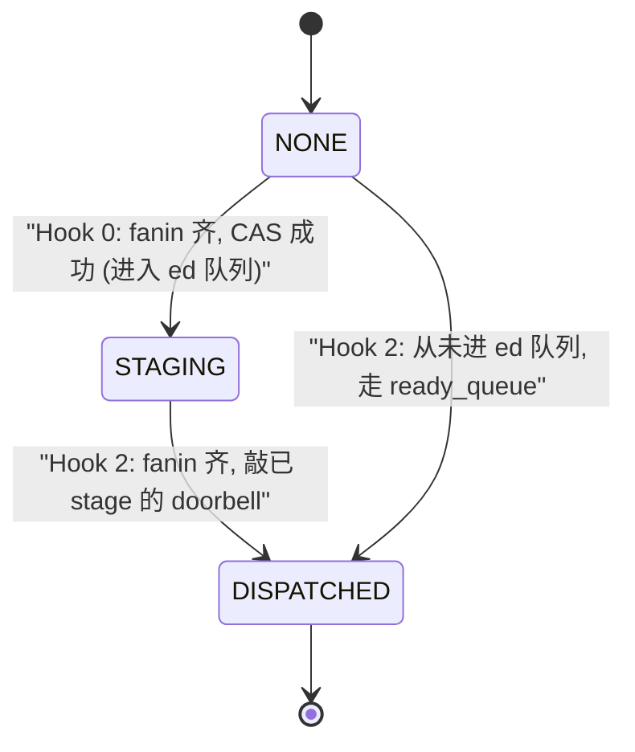

# early-dispatch 设计方案

> 面向"设计层"读者，讲清 what/why、关键取舍、遗留问题、roadmap。
> 一期落地的代码修改细节参见同目录下 `early-dispatch一期开发方案.md`。

---

## 1. 背景与目标

### 1.1 传统 dispatch 的 head overhead

在没有 early-dispatch（以下简称 ed）之前，一个 successor task（简称 s-task）要开始跑，必须走完一段串行链路：

```
p-task 最后一个 block FIN
  -> AICPU 收到 FIN
  -> cutter/painter 处理 fanin（减 predecessor_cnt，判 0）
  -> 把 s-task 推入 ready_queue
  -> 下一轮 dispatch pop 出 s-task
  -> build_payload（准备 kernel 参数）
  -> 写 DATA_MAIN_BASE 寄存器（发 token 到 AI core）
  -> AI core 收 token
  -> dcci 刷 cache
  -> AI core 开始跑 s-task
```

这段"p FIN → s 开始"的时间叫 **head overhead**。每个 kernel 都要额外付一次，累加起来对端到端吞吐影响明显。

### 1.2 ed 的核心思想

**在 p-task 还没跑完的时候，就把 s-task 的 payload 写到某个 AI core 上、让它先在 gate 里等着；等 p-task 一 FIN，AICPU（或未来的 STARS）立刻给这个核发一个 ready 信号，AI core 越过 gate 马上开跑。**

也就是说：payload 准备、NoC 传输、cache 刷新等等，**全部与 p-task 的执行时间重叠**。p-task 一结束，s-task 只需要等一个寄存器写入的时间就能开跑。

---

## 2. 术语约定

| 术语 | 含义 |
| --- | --- |
| `p-task / s-task` | predecessor task / successor task |
| `p-core / s-core / stage-core` | 跑 p-task 的 AI core / 跑 s-task 的 AI core / ed 占位所在的 AI core（可能是某个 p-core，也可能是空闲 core） |
| `OSTD / slot` | 一个 AI core 上的在途任务位，`AIC_OSTD = 2` 表示每核 2 个 slot；**正在跑的任务也占一个 slot**，跑完才释放 |
| `gate` | AI core 上的等待状态（`slot_state == GATED`），收到唯一 ready 通知后转为 `RUNNABLE` |
| `doorbell / ready 信号` | 由 AICPU 或 STARS 写到 AI core 上的一个字节 / 寄存器位；一期由每任务 `notify_claimed` 保证只写一次 |
| `spec_state` | ed 的 3 态机：`NONE / STAGING / DISPATCHED` |
| `slot_state` | 每个 executor slot 的原子发布状态：`EMPTY / GATED / RUNNABLE`；executor 只在 acquire 读到 `RUNNABLE` 后读取 payload |
| `dispatch_fanin` | s-task 视角下"已被 dispatch 的前驱数"（区别于 `unfin_pred_cnt`：尚未 FIN 的前驱数） |
| `next_block_idx` | 一期是任务派发认领进度：normal dispatch 原子认领 `0 → count`（executor 仍按整任务执行），Hook 1 仅对 `count == 1` 认领 `0 → 1`；M3 在 executor 改成逐 block 语义后才升级为块级指针 |
| `AICPU` | 昇腾芯片里的控制型 CPU，本仓库里指跑 dispatch/cutter 的调度线程 |
| `AI core` | 真正做计算的核，本仓库里由 `executor_worker` 模拟 |

---

## 3. 与 simpler 的关系

本设计站在 simpler 仓 `3af9c5e4 feat(a2a3/runtime): speculative early-dispatch (pre-stage + doorbell)` 之上，参考了 `my-simpler/my_outputs/early-dispatch-report.md` 的完整分析。

### 3.1 继承

- **Hook 0/1/2 三段式**：
  - Hook 0 = `propagate_dispatch_fanin`（每 dispatch 一个 task 就通知它的 successor）
  - Hook 1 = `try_speculative_early_dispatch`（从 ed_ready_queue pop 出 s-task 并 stage 到某个 core）
  - Hook 2 = `try_speculative_release`（收到 FIN 时敲 doorbell 或走 ready_queue）
- **`spec_state` 3 态机**：`NONE → STAGING → DISPATCHED`，全程用 CAS 转移，无锁
- **CAS 抢占 stage-core slot**：保证同一个 slot 只被一次 stage
- **`next_block_idx` 块级进度指针**：Hook 1 stager 与 normal dispatch 用同一个 `next_block_idx` 原子 CAS 抢块，保证同一个 block 不会被派发两次（这是"Hook 1 stage 中 Hook 2 抢先"race 的根本去重机制）
- **stager 补通知**：Hook 1 完成 stage 后再次 seq_cst load `spec_state`；若已 DISPATCHED，则与 Hook 2 竞争每任务 `notify_claimed: 0 → 1`，只有 CAS 成功者写一次 doorbell（详见 5.10）

### 3.2 简化

- **AI core 端不自解依赖**：simpler 里 AI core 只等一个 doorbell（因为 AICPU 已经在 releaser 里做完了 fanin 汇聚）。本设计沿用同样的 AI core 端语义——**AI core 保留 simpler 风格单 doorbell gate 循环**。汇聚多个 FIN 变成"一个 ready 信号"这件事，交给 AICPU 或 STARS 做，不下沉到 AI core kernel 层。
- **一期单点 stage**：simpler 用 `staged_core_mask` 位图记录"s-task 被 stage 到了哪些核"（为了 SPMD 部分 stage）；本一期只支持 `count == 1` 的 s-task，`g_staged_slot[s-task]` 只需记 `{core, slot}` 单个位置，实现简单，代价是不支持 SPMD 部分 stage（放到 M3 补）。

### 3.3 演进

- **AICPU 转发（方案 4.1）** 与 **STARS 转发（方案 4.2）** 对 AI core 端**语义等价**——AI core 只等一个 ready 信号，不 care 谁发的。所以一期先做 AICPU 转发，二期只需要替换 Hook 2 的转发通道，AI core 端代码无需二次改造。

---

## 4. 核心架构

### 4.1 三阶段时序

```mermaid
sequenceDiagram
    participant P as "p-task on p-core"
    participant CPU as "AICPU (dispatch + cutter)"
    participant EDQ as ed_ready_queue
    participant RDQ as ready_queue
    participant SC as "stage-core (p-core or idle)"
    participant S as s-task

    Note over CPU,P: "Hook 0: send_task 后"
    CPU->>CPU: "propagate_dispatch_fanin(p) -> ++dispatch_fanin[s]"
    CPU->>CPU: "fanin 齐 -> CAS(NONE->STAGING)"
    CPU->>EDQ: push(s)

    Note over CPU,SC: "Hook 1: dispatch 主循环 (seq_cst 序列, 见 5.10)"
    CPU->>EDQ: pop(s)
    CPU->>CPU: "CAS next_block_idx: 0 -> 1 (抢块)"
    CPU->>SC: "抢 slot, 写 payload, release 发布 GATED"
    CPU->>CPU: "release 发布 slot_state=GATED; 写 staged_slot (seq_cst)"
    CPU->>CPU: "atomic_load spec_state (seq_cst)"
    Note right of CPU: "若 DISPATCHED: CAS notify_claimed，胜者敲一次"
    SC->>SC: "gate 循环等 doorbell"

    Note over P,SC: "p-task 完成, AICPU 收 FIN"
    P->>CPU: FIN
    Note over CPU,SC: "Hook 2: resolve_dep (seq_cst 序列)"
    CPU->>CPU: "--unfin_pred_cnt[s], 判 0"
    CPU->>CPU: "CAS(STAGING->DISPATCHED) (seq_cst)"
    CPU->>CPU: "atomic_load staged_slot (seq_cst)"
    CPU->>SC: "CAS notify_claimed，胜者敲一次并发布 RUNNABLE"
    CPU->>RDQ: "push(s) [靠 send_task 里 next_block_idx 去重]"
    SC->>S: "越 gate, 执行"
```

### 4.2 `spec_state` 状态转移

`spec_state` 3 态**只做单向推进，不做撤销**——去重靠 `next_block_idx` 块级抢占（见 5.10）。



- **NONE**：s-task 尚未进入 ed 流程（未 fanin 齐 或 fanin 齐但因 SPMD/count 约束不走 ed）
- **STAGING**：Hook 0 CAS 成功，s-task 已入 `ed_ready_queue`（不代表已完成 stage，只代表"进入 ed 候选"）
- **DISPATCHED**：Hook 2 已判 fanin 齐并完成 release（敲 doorbell + 视情况入 ready_queue）

**关键**：STAGING 状态只是"入 ed 队列"标记，并不承诺"executor 上已有数据"。真实的 stage 完成情况由 `next_block_idx` 和 `staged_core_mask`（一期简化为 `g_staged_slot`）表达。

### 4.3 数据流的四条通路

| 场景 | 通路 | 是否入 ready_queue | 是否派发到 core |
| --- | --- | --- | --- |
| ed 命中（Hook 2 后于 Hook 1 stage） | Hook 0 → Hook 1（stage 成功，`next_block_idx++`）→ Hook 2 读到已 stage → 敲 doorbell | 是（但 send_task 靠 `next_block_idx` 跳过） | 仅 stage-core，通过越 gate |
| ed 命中（Hook 2 先于 Hook 1 stage 发布） | Hook 0 → Hook 1 CAS `next_block_idx` → 写 executor → Hook 2 读到 staged slot 无效，不认领通知 → Hook 1 发布后读到 DISPATCHED，CAS `notify_claimed` 成功并敲一次 | 是（但 send_task 靠 `next_block_idx` 跳过） | 仅 stage-core，通过越 gate |
| ed 完全未 stage（Hook 2 触发时 `next_block_idx == 0`） | Hook 0 → 但 Hook 1 尚未 stage → Hook 2 push ready_queue | 是 | normal dispatch pop 后正常派发 |
| ed 未触发（fanin 未齐 或 SPMD/count 约束） | 常规 cutter → resolve_dep → ready_queue → dispatch pop → send_task | 是 | normal dispatch pop 后正常派发 |

**关键**：不管走哪条通路，s-task 都会入 ready_queue（简化实现，不做"跳过入队"优化）；避免重复执行完全靠 `next_block_idx` 在 `send_task` 侧过滤——若 stager 已抢块（`next_block_idx == count`），send_task 读到剩余块数 = 0，直接跳过不派发。

---

## 5. 关键设计取舍

### 5.1 依赖解析位置：AICPU（一期）+ STARS（二期）

- **选**：AICPU 完成 fanin 汇聚后发单一 ready 信号；AI core 端只等一个 doorbell
- **未选**：AI core 端自解依赖（每 slot 维护 `remaining_predecessor_cnt`，收到 FIN 减计数判 0）
- **理由**：
  - AI core 是计算型硬件，塞控制流会占用宝贵的计算资源
  - 需要每 s-task 的 predecessor 元数据随 payload 下发，kernel 层复杂度显著上升
  - AICPU 侧的"遍历 successor + 一次寄存器写"本身就是极短路径，vs "维护 pending_pred_cnt + 幂等处理 + 乱序 FIN" 的净收益并不明显
  - STARS 的 wait-many 注册和 AICPU 转发**语义等价**（都是"多 FIN 汇聚成一个 ready"），后续可平替

### 5.2 stage 目标核范围：p-core ∪ 空闲 core

- **选**：候选核 = { 任一 slot free 的 core } ∩ { p-core 集合 ∪ 空闲 core }
- **未选**：simpler 那样只 stage 到"完全空闲的核"
- **理由**：
  - 空闲 core 集合在实际 workload 上可能长期非常小
  - 空闲 core 挂在 gate 上等，跟被占位的 p-core 挂在 gate 上等本质是同一件事——都要等最后一个 p-task FIN
  - 扩展候选集不改变正确性，只是让 ed 命中率提高

### 5.3 选核策略：随机

- **选**：从 s-task 的前驱集合里**随机**挑一个"有空 slot"的 p-core（若都没有空 slot，fallback 到普通空闲 core）
- **未选**：基于 `duration` 估计"最晚完成"的 p-core 优先选
- **理由（首期简化）**：
  - 随机实现简单，代码 20 行以内
  - 空转成本不为零但可控（stage-core 提前 FIN 会挂 gate 等最后一个前驱 FIN，损失上限 = 最晚前驱剩余时长）
  - duration-based 选核作为 M4 里的优化项，等 M2 拿到 metric 后再定

### 5.4 stage 粒度：一期"一 block 一 slot"，M3 扩展为"多 block 多 slot"

- **一期**：一 s-task 只有 1 个 block（约束 `count == 1`），只占用 1 个 stage-core slot；`g_staged_slot[s-task]` 用单个 `{ core, slot, type }` 结构记录 stage 位置
- **M3 SPMD**：必须先把 executor 改成"一个 slot 只代表一个 block"或显式携带 block range，再让每个 block 各自 stage 到空闲 slot；届时 `g_staged_slot` 与 `notify_claimed` 都升级为 per-block 数组/位图，Hook 2 对每个 staged block 恰好通知一次，normal dispatch 只领取未 stage 的 block
- **架构关系**：状态机骨架可复用，但 M3 不是只改标量为数组：
  - `spec_state` 3 态机的语义是**s-task 粒度**，与 block 数无关，M3 不用改
  - Hook 0/1/2 的骨架逻辑保持不变；M3 还必须同步修改 executor 的整任务执行语义、完成计数和剩余 block 回队协议
- **理由（一期简化）**：
  - simpler 的多点 stage 主要是为了 SPMD；一期只做 `count == 1`，用不到位图或数组
  - 多点 stage 涉及"CAS `next_block_idx` 抢块 + 位图维护 + release 遍历敲多 doorbell + 部分 stage 剩余块回 ready_queue"，复杂度较高，先在一 block 场景下把骨架稳住

### 5.5 触发阈值 N：`ED_UNFIN_THRESHOLD`，一期取 ∞

- **语义**：s-task 的所有前驱中，尚未 FIN 的数量 `<= N` 且所有前驱均已 dispatch，才触发 stage
- **一期取值**：`N = ∞`（`0xFFFF`），等价"全部前驱已 dispatch 就 stage"，与 simpler 对齐
- **理由**：一开始就锁 `N=1`（只剩最后 1 个前驱未 FIN 才 stage）会导致 ed 命中率极低，误判整套机制的价值。先在 `N=∞` 下测出 ed 上限收益，再根据实测数据往下调看性能拐点

### 5.6 OSTD 语义：正在跑的任务也占位

- **观察**：`AIC_OSTD = 2` 表示每 AI core 最多同时挂 2 个任务，**正在跑的任务也占 1 个 slot**，跑完才释放
- **对 ed 的影响**：若某 p-core 只有 1 个空 slot、被 ed 抢占，则它没法再预取"下一个 p-task"（原本可以 ping-pong 无缝衔接）——**ed 可能吃掉这个 p-core 的 pipeline buffer**
- **一期取舍**：不做 outstanding 水位保留（如"free slot <= 阈值就禁止 ed 占用"），接受此代价；M4 里加水位机制作为优化

### 5.7 SPMD 支持：一期只处理 `count == 1`

- **理由**：SPMD 部分 stage（`next_block_idx` pop-claim-repush 模式）逻辑复杂，且需要位图多点 stage
- **一期做法**：Hook 0 里判断 `g_basic_buf[s].count == 1` 才进入 STAGING 流程，否则走常规路径
- **M3 里补齐**：`next_block_idx` 原子领块 + `staged_core_mask` 多点 stage + Hook 2 剩余 block 入 ready_queue

### 5.8 Hook 1 抢 slot 失败的处理：方案 β（re-push）

- **场景**：Hook 1 pop 出 s-task 后，选中的 stage-core slot 被别的线程/dispatch 先抢走（`free_bitmap` CAS 失败），此时 `next_block_idx` 尚未 CAS（还没抢块）
- **方案 β（选）**：把 s-task **re-push 回 `ed_ready_queue`**，`spec_state` 保持 STAGING 不变，等下一轮 dispatch 循环再次 pop 重试
- **方案 α（未选）**：CAS 回滚 `spec_state STAGING → NONE`，等下次 Hook 0/Hook 1 触发
- **未选 α 的理由**：Hook 0 只在"p-task 被 dispatch"时触发，如果所有 p-task 都已 dispatch 完，回滚后就再也不会有 Hook 0 触发的机会，s-task 只能靠 Hook 2 兜底走 ready_queue——但这时 ed 已彻底失效
- **与 simpler 对齐**：simpler 也是 re-push 到 `early_dispatch_queue`，不撤销状态
- **注意 1**：re-push 时**不要 CAS `next_block_idx`**——否则会把这个 s-task 从 normal dispatch 手里"偷"走一个块但又没真派发，导致漏派发。CAS `next_block_idx` 必须发生在"确认已抢到 slot 之后"（见 §5.10、§5.14）
- **注意 2（顺序修正，见 §5.14）**：`try_early_dispatch` 内部**先抢 slot（②' `atomic_fetch_and` free_bitmap 位）、后 CAS 抢块（③' `next_block_idx`）**。抢 slot 失败走本节的 re-push；抢块 CAS 失败时**回退 slot 位（`atomic_fetch_or`）后放弃**，不 re-push（此时 s-task 已被 `send_task` 或另一 stager 抢走）

### 5.9 ready_queue 与 `next_block_idx` 协同：一期采用整任务原子认领

- **ready_queue 保留**：不做"ed 命中就跳过入队"的优化。Hook 2 无论 `spec_state` 走到哪，都统一 push s-task 到 ready_queue（简化 Hook 2 分支）
- **重复派发的避免机制**：normal `send_task` 对任意 `count` 只允许 CAS `next_block_idx: 0 → count`，一次认领整个任务；executor 继续执行该任务的全部 block。Hook 1 仅允许 `count == 1`，CAS `0 → 1`
- **一期 count == 1 的语义退化**：`next_block_idx ∈ {0, 1}`，退化为"是否已被 stager 抢占"的 boolean：
  - `next_block_idx == 0`：stager 尚未抢块，normal dispatch 正常派发（这是"ed 完全未 stage"的兜底）
  - `next_block_idx == 1`：stager 已抢块，normal dispatch 跳过不派发（stager 会敲或已敲 doorbell，AI core 会跑）
- **理由**：这与当前 executor 的"一个派发条目执行整任务"语义一致。不能在 count>1 时只做 `K → K+1` 却让 executor 执行整任务；M3 引入部分 stage 时必须成套重写，不能沿用一期 normal claim。

### 5.10 Hook 1/2 的恰好一次通知与 slot 发布

布尔 doorbell 的重复写不是幂等操作：executor 清 0 并完成后，迟到的第二次写 1 会污染下一次 slot 复用。因此不能接受"至少一次通知"，必须由每任务原子 `g_notify_claimed[s]` 保证**恰好一次**，并由 `slot_state` 建立 payload 发布边界。

> **重要修正**：
> - **`g_staged_slot_record` 必须是 `_Atomic uint64_t`**（见 §5.13）：高 32 位完整 task tag，低 32 位打包 core/slot/type。Hook 1 ⑥ seq_cst store，Hook 2 seq_cst load；既消除非原子 struct data race，也拒绝 ring 旧代 ABA。
> - **"抢块 CAS"必须在"抢 slot"之后**（见 §5.14）：原顺序（先 CAS `next_block_idx`、后抢 slot）会在"抢块成功但抢 slot 失败"分支被迫回滚 `next_block_idx`；此回滚窗口里 `send_task` 若已读到 `next_block_idx == count` 会 skip 掉 s-task，而 stager 回滚后只 re-push 到 `ed_ready_queue`，`ready_queue` 一侧的 s-task 被静默丢弃。修正后：先抢 slot、后 CAS 抢块；抢块失败必须**用 `atomic_fetch_or` 回退 slot 位**，否则 slot 永久泄漏。
> - 每次 ring slot 初始化必须重置 `g_notify_claimed=0`；每次 executor slot 分配必须先确认 `slot_state==EMPTY`。normal 与 ed 都在 payload 写完后 release 发布状态，executor acquire 后才读取 payload。

```
Hook 1 stage 单个 block (伪代码, 全部 seq_cst):
  ① load spec_state
     若 != STAGING (Hook 2 已抢先 DISPATCHED 且 next_block_idx = 0): 放弃, s-task 走 ready_queue
  ②' 挑候选 (core_X, slot_Y) = pick_stage_core() -> 抢 slot (atomic_fetch_and free_bitmap 位)
     若失败 (bit 已被 send_task/其他 stager 清 0): re-push s-task 到 ed_ready_queue (方案 β),
                                                    保持 spec_state=STAGING, 不动 next_block_idx
  ③' CAS next_block_idx: K -> K+1  (抢块; M2 一期 K=0)
     若失败 (send_task 或另一 stager 已 CAS 成功):
        必须回退 slot: atomic_fetch_or free_bitmap 把 (core_X, slot_Y) 位加回, 否则 slot 永久泄漏
        放弃本次 stage (不 re-push, s-task 由 send_task 或 ready_queue 兜底派发)
  ④ 写 executor 数据 (slot 尚未发布，单写者):
     4a: atomic_store(doorbell[slot], 0, relaxed)
     4b: 写 tasks/block_idx/duration/task_id_map
     4c: atomic_store(slot_state[slot], GATED, release)
  ⑥ atomic_store(g_staged_slot_record[s_idx], pack_record(task_tag, core_X, slot_Y, type), seq_cst)
  ⑦ atomic_load(spec_state, seq_cst)  <- 自检
     若 DISPATCHED: 调 notify_once(s, packed, SELF)
     若 STAGING:    结束, 后续由 Hook 2 敲

对应 Hook 2 release 序列 (全部 seq_cst):
  ① atomic_exchange(spec_state, DISPATCHED)  (原子拿到 old, 一次搞定 NONE→DISPATCHED 或 STAGING→DISPATCHED)
  ② 若 old == STAGING:
        packed = atomic_load(g_staged_slot_record[s_idx], seq_cst)
        若 task_tag 匹配且 core 有效: 调 notify_once(s, packed, HOOK2)
        若 core(packed) == 0xFFFF: 不敲, 靠 stager ⑦ 自敲兜底
     若 old == NONE: 无需读 g_staged_slot (从未走过 ed)
     若 old == DISPATCHED: 不应发生 (单 cutter 线程 + predecessor_cnt 单调递减保证只触发一次;
                                    出现即为 bug, 打印告警并跳过)
  ③ 无论敲没敲, 都 push s-task 到 ready_queue (由 send_task 靠 next_block_idx 去重)

notify_once(s, packed, source):
  ① 校验 packed.task_tag == 当前 s 的完整 task-id/generation；失败直接返回
  ② CAS g_notify_claimed[s]: 0 -> 1 (acq_rel); 失败则直接返回，禁止写 doorbell
  ③ atomic_store(doorbell[slot], 1, relaxed)
  ④ CAS slot_state[slot]: GATED -> RUNNABLE (release)
     若失败是协议错误：记录 fatal/assert；不得再写第二次或静默继续
  ⑤ 只按 source 增加 hit_cnt 或 self_notify_cnt 中的一个
```

**seq_cst 双向 + 唯一通知的正确性**（前提：`g_staged_slot_record` 是带 generation 的 seq_cst 原子对象）：

| Hook 1 与 Hook 2 时序 | 结果 |
| --- | --- |
| Hook 1 完成 ⑥ 后 Hook 2 才 exchange ① | Hook 2 CAS `notify_claimed` 成功并通知；Hook 1 后续即使读到 DISPATCHED，CAS 失败，不会重复写 |
| Hook 2 exchange ① 后 Hook 1 才 store ⑥ | Hook 2 load 到 packed 仍是 INVALID → 不敲；Hook 1 ⑦ 读到 DISPATCHED → **自敲补位** |
| Hook 2 exchange ① 在 Hook 1 ③' 之前 | Hook 1 ③' CAS `next_block_idx` 失败 → 回退 slot → 放弃本次 stage；s-task 通过 ready_queue + send_task 兜底派发 |

**结论**：每个成功 stage 的任务 doorbell **恰好写一次**；未 stage 的 s-task 由 ready_queue + normal dispatch 兜底。`slot_state` 还保证 normal dispatch 和 ed 的 payload 都在 executor acquire 读取前完整发布。

### 5.11 一期通知所有权：per-task 单 slot

- 一期 `count==1`，每任务只有一个 generation-tagged staged record；stager 使用刚发布的 record，Hook 2 原子读取同一 record
- 两者都可调用 `notify_once`，但只有 `notify_claimed` CAS 成功者能写 doorbell；失败者不产生寄存器写
- M3 多 block 时必须把 record 与 notify claim 同时升级为 per-block，不能共享一个 task 级 claim

### 5.12 Hook 0 迟到 s-task 的 fanin 补齐

**问题场景**：Hook 0（`propagate_dispatch_fanin`）迭代的是 p-task 的 `g_successor_buf[p_idx]`。这份 successor list 只在 **cutter 的 `add_successors` 处理 s-task commit** 时才把 s 挂进去。如果 p 已经被 `send_task` dispatch（此时 Hook 0 已经跑过一次，且 s 还没在 successor list 里），事后才有 cutter 把 s 挂到 p 的 successor list——**Hook 0 对 s 的 fanin 计数永远缺失一次**：
- `g_dispatch_fanin[s]` 达不到 `g_dispatch_fanin_target[s]`，`spec_state` 永远停在 `NONE`；
- Hook 2 触发时 `atomic_exchange(NONE → DISPATCHED)`、`g_staged_slot` INVALID → 不敲 doorbell，s-task 走 normal ready_queue；
- 表面正确性没问题，但 **ed 完全 miss**，命中率异常低（尤其 s-task commit 时间晚于 p-task dispatch 时机的场景）。

**修正方案骨架**：不能并发读写普通 successor list，也不能用完成后会清空的瞬时 core map 判断"曾 dispatch"。增加 per-pred `g_ed_edge_lock[p_idx]`、当前槽代际 `g_ring_task_tag[p_idx]` 和持久记录 `g_dispatch_tag[p_idx]`。

`add_successors` 与 Hook 0 的每条边级动作**都必须**在同一把 `g_ed_edge_lock[p_idx]` 里做；`add_successors` 整体需要拆成"第一趟本地扫描 + 第二趟锁内 append/补 fanin"的**两趟结构**，第一趟决定 `g_dispatch_fanin_target` 与 snapshot，第二趟才允许把 s 挂到任何 pred 的 successor list（否则会出现"target 未定但已被 Hook 0 计数"的窗口）。

#### 5.12.1 `add_successors` 两趟流程（可执行伪代码）

```
// 输入: cq_buf 与 ready 输出缓冲已由 cutter 上游准备好.
// 处理范围: [g_commit_task_id, min(g_commit_task_id + PRE_BATCH_SIZE, g_task_id))
add_successors():
  end = min(g_commit_task_id + PRE_BATCH_SIZE, atomic_load(&g_task_id))
  while g_commit_task_id < end:
      s_full = g_commit_task_id                    // 完整 task-id, 与 ring gen tag 严格一致
      s_idx  = s_full & RING_MASK
      ptr    = &g_predecessors[s_idx]
      s_type = g_basic_buf[s_idx].type             // TASK_TYPE_*; 一期 MIX==VECTOR 见 §5.18

      // ----------- 通路 A: 根任务, 直接 ready -----------
      if ptr->cnt == 0:
          ed_init_task_meta(s_full, /*predecessor_cnt=*/0)   // 见 §5.12.2, ring 复用防护
          rq_buf[s_type][ready_cnt[s_type]++] = s_full
          g_commit_task_id++
          continue

      // ----------- 第一趟: 只做本地扫描, 不动全局 successor list, 不进锁 -----------
      // 目标: 算出存活 pred 数 predecessor_cnt, 生成 pred snapshot (供选核用),
      //       然后 **在挂任何边之前** 用 ed_init_task_meta 写死 target/初值.
      original_cnt = ptr->cnt
      predecessor_cnt = 0
      survivors[CON_NODE_CNT]                       // 存 (p_full, p_idx)
      for k in 0..original_cnt-1:
          p_full = ptr->exp[k]                      // Manager 侧写入完整 task-id
          p_idx  = p_full & RING_MASK
          if g_state_buf[p_idx].state != TASK_STATUS_COMPLETED:
              survivors[predecessor_cnt++] = { p_full, p_idx }
      // 注意 1: 第一趟只读 g_state_buf.state, 不校验 g_ring_task_tag.
      //         ring 换代后 state 会被 ed_init_task_meta 重置, 不会误判.
      // 注意 2: ptr->cnt / ptr->exp 的物理消费推迟到第二趟结束, 避免中途 return 漏消费.

      // ----------- 关键屏障: 先固化 s 的 ed 元数据 -----------
      // 只有先写好 g_dispatch_fanin_target / g_dispatch_fanin=0 / g_unfin_pred_cnt=P,
      // 后续 Hook 0 或第二趟的 late-arrival 补 fanin 才能对齐同一个 target.
      // ed_init_task_meta 内部会拿 s 自己的 edge lock, 更新 g_ring_task_tag[s_idx],
      // 清空 g_successor_buf[s_idx] 与 g_dispatch_tag[s_idx] (防 ring 换代残留).
      ed_init_task_meta(s_full, predecessor_cnt)
      for k in 0..predecessor_cnt-1:
          g_ed_pred_snapshot[s_idx].node[k] = survivors[k].p_full
      g_ed_pred_snapshot[s_idx].cnt = predecessor_cnt
      g_predecessor_cnt[s_idx] = predecessor_cnt

      // ----------- 通路 B: 存活 pred 数为 0, 走 normal ready_queue -----------
      if predecessor_cnt == 0:
          rq_buf[s_type][ready_cnt[s_type]++] = s_full
          ptr->exp += original_cnt; ptr->cnt = 0    // 回收 predecessor_list
          g_commit_task_id++
          continue

      // ----------- 第二趟: 每条存活 pred 独立进锁, append + late-arrival 补 fanin -----------
      for k in 0..predecessor_cnt-1:
          p_full = survivors[k].p_full
          p_idx  = survivors[k].p_idx

          ed_edge_lock(p_idx)
          // 二次校验: 第一趟看到 state != COMPLETED, 但到这里 p 可能已经 FIN 并被 ring 换代
          if atomic_load_acquire(&g_ring_task_tag[p_idx]) != p_full:
              ed_edge_unlock(p_idx)
              // 三种可能: p 完成后已被下一代覆写; p 完成的 FIN 会走 Hook 2 减 unfin.
              // 但 §5.12.3 里 g_unfin_pred_cnt 已在 ed_init_task_meta 里按 predecessor_cnt 初始化,
              // 而这里 append 没发生 -> Hook 2 不会为这条边做 unfin--; 必须由我们把它抵消一次.
              atomic_fetch_sub_release(&g_unfin_pred_cnt[s_idx], 1)
              // 同理, dispatch_fanin 目标也没有对应输入, 需要补 +1 (曾 dispatch 的证据: ring 换代=已完成=已 dispatch)
              v = atomic_fetch_add_acq_rel(&g_dispatch_fanin[s_idx], 1) + 1
              atomic_fetch_add_relaxed(&g_ed_late_arrival_cnt, 1)
              maybe_enter_staging(s_full, s_idx, v)   // 见下方 helper
              continue

          // 锁内 append: 这一步之后 Hook 0 才能"看到"这条边
          k_pos = g_successor_buf[p_idx].cnt
          g_successor_buf[p_idx].node[k_pos] = s_full
          g_successor_buf[p_idx].cnt = k_pos + 1
          g_state_buf[p_idx].successor_cnt++

          // 判断本代 p 是否曾经 dispatch (持久 tag, 完成后不清)
          dispatched_this_gen =
              atomic_load_acquire(&g_dispatch_tag[p_idx]) == p_full
          ed_edge_unlock(p_idx)

          if not dispatched_this_gen:
              continue     // Hook 0 尚未跑过本代 p; 将来 Hook 0 会看到 append 并 +1 fanin

          // late-arrival: p 本代已 dispatch, Hook 0 遍历时看不到 s, 我们对这条边补 +1
          v = atomic_fetch_add_acq_rel(&g_dispatch_fanin[s_idx], 1) + 1
          atomic_fetch_add_relaxed(&g_ed_late_arrival_cnt, 1)
          maybe_enter_staging(s_full, s_idx, v)

      ptr->exp += original_cnt; ptr->cnt = 0        // 回收 predecessor_list
      g_commit_task_id++

// -----------
// helper: fanin 到齐后尝试 STAGING
// -----------
maybe_enter_staging(s_full, s_idx, v):
    if v != g_dispatch_fanin_target[s_idx]: return
    if g_basic_buf[s_idx].count != 1:       return      // 一期约束
    if atomic_load_acquire(&g_unfin_pred_cnt[s_idx]) > ED_UNFIN_THRESHOLD: return
    exp = ED_SPEC_NONE
    if CAS_acq_rel(&g_spec_state[s_idx], &exp, ED_SPEC_STAGING):
        ed_enqueue_or_abandon(s_full)
```

#### 5.12.2 `ed_init_task_meta` 与 s 自身 edge lock 的关系

`ed_init_task_meta(s_full, P)` 承担"ring 换代"职责，必须持有 `g_ed_edge_lock[s_idx]` **在写以下字段前后**建立线性化点：

| 步骤 | 操作 | 说明 |
| --- | --- | --- |
| ① | lock(g_ed_edge_lock[s_idx]) | 拒绝任何将 s 作为 pred 的其他 add_successors 第二趟同时进入 |
| ② | store g_ring_task_tag[s_idx] = s_full (release) | 声明本代生效；后续任何 append 都必须先校验 tag |
| ③ | store g_dispatch_tag[s_idx] = INVALID (relaxed) | 本代 s 还没被 dispatch |
| ④ | reset g_successor_buf[s_idx].cnt = 0; g_state_buf[s_idx].successor_cnt = 0 | 清空上一代残留 successor 边（进入本代前必清） |
| ⑤ | unlock(g_ed_edge_lock[s_idx]) | 之后 add_successors 第二趟才能把 s 挂到别的 p 上，因为 s 自身状态已复位 |
| ⑥ | 锁外原子写 g_dispatch_fanin_target / g_dispatch_fanin=0 / g_unfin_pred_cnt=P / g_spec_state=NONE / g_next_block_idx=0 / g_staged_slot_record=INVALID / g_notify_claimed=0 | ⑥ 里的字段都是 s 自己的 ed 元数据，且第二趟只会在 ⑤ 之后才有机会读到它们，`atomic_store(release)` 足够 |

**注意**：这里的 lock 是"s 作为 pred（他人依赖 s）"这一角色的锁；`add_successors` 第二趟拿的是"s 作为 succ（挂到 p）"用到的**另一个** pred p 的锁——即 `g_ed_edge_lock[p_idx]`。两把锁不同、不会自锁。

#### 5.12.3 Ring 换代与两趟结构的正确性证明

对每条 (s, p) 边，只有以下三种可能的线性化结果：

| 情形 | 顺序 | 结果 |
| --- | --- | --- |
| ①  | Hook 0 for p 早于 add_successors 第二趟的 lock(p_idx) | append 发生在 Hook 0 之后；退出锁后读到 `g_dispatch_tag[p_idx] == p_full`，走 late-arrival 补 +1 |
| ②  | add_successors 第二趟的 lock(p_idx) 早于 Hook 0 for p | append 发生在 Hook 0 之前；Hook 0 在自己的锁里遍历时会看到 s，为这条边加 +1 |
| ③  | p 已完成并被 ring 换代 | 第二趟 tag 校验失败；此时 unfin_pred_cnt 需要多减 1（因为无 Hook 2 会为不存在的边减）、dispatch_fanin 也需要补 +1（p 本代已经 dispatch 过） |

三种情形下 `g_dispatch_fanin[s]` 累加值都恰好等于 `predecessor_cnt`，即 `g_dispatch_fanin_target[s]`；对应地 `g_unfin_pred_cnt[s]` 也刚好被减到 0（正常 FIN + 情形③补减）。**没有漏计/双计**。

**ring slot 换代的锁边界**：当一个 ring slot 被下一代任务复用时，`ed_init_task_meta` 里 ② 的 tag 更新与 ④ 的 successor 表清空必须在同一把 `g_ed_edge_lock[p_idx]` 内完成；任何 add_successors 第二趟或 Hook 0 都在 lock 后立刻校验 `g_ring_task_tag`，看到 tag 不匹配就退出——不会误 append 到旧代 successor 表、也不会误对新代 fanin 计数。

**为何必须放在 add_successors 里而不是 Hook 0 里**：Hook 0 在 dispatch 线程；add_successors 在 cutter 线程。s 加入 successor list 与 p dispatch 是同一 s 与不同 p 之间的两个独立事件，只有 add_successors 一方能感知到"s 加入 successor list 这一刻 p 是否已 dispatched"。若放到 Hook 0 里补齐，就需要遍历所有 s 的 pred——O(N²) 且逻辑错位。

**权衡**：一期 workload（qwen3 / paged_attention）里 pred/succ 关系相对固定，实测该场景发生的比例待 M2 数据。若比例低（<5%），也可以先跳过此补齐、接受 ed miss；但**必须**在设计文档里显式承认此路径，避免运维时误以为 ed miss 是"随机现象"。

### 5.13 staged/dispatch 记录必须原子化并携带 generation

**问题**：原设计里 `ed_staged_slot_t { uint16_t core; uint8_t slot; uint8_t type; }` 是 4 字节 struct，Hook 1 在 dispatch 线程 non-atomic 写、Hook 2 在 cutter 线程 non-atomic 读——按 C11 §5.1.2.4，跨线程未同步的非原子读写就是**数据竞争**（UB）。`atomic_thread_fence(seq_cst)` 只对**原子操作序列**建立 happens-before，对紧邻的非原子对象读写没有约束，即使 fence 摆得再对，也可能读到撕裂值（例如 core 字段读到新值、slot/type 字段读到旧值）。

**修正**：位置本身可打包成 32 位，但跨 ring 复用的共享记录使用 `_Atomic uint64_t`，高 32 位是完整 task-id/generation，低 32 位是位置：

```
slot_packed = (type << 24) | (slot << 16) | core
record = ((uint64_t)task_tag << 32) | slot_packed
core = packed & 0xFFFF          // 低 16 位, 0xFFFF = INVALID
slot = (packed >> 16) & 0xFF    // 一期 AIC_OSTD=2, slot ∈ {0, 1}
type = (packed >> 24) & 0xFF    // 一期 EXE_TYPE_CNT=2, type ∈ {0, 1}

Hook 1 ⑥: atomic_store(&g_staged_slot_record[s_idx], record, seq_cst);
Hook 2 ②: uint64_t r = atomic_load(&g_staged_slot_record[s_idx], seq_cst);
           if (record_tag(r) != s_full_task_id) return;  // 拒绝旧代
```

初始化：每一代 task commit 时 store `ED_RECORD_INVALID`，同时清 `notify_claimed=0`。`g_task_dispatch_record` 采用同样格式；完成时只能 CAS/校验 tag 后清瞬时位置。独立的 `g_dispatch_tag` 完成后不清，用于表示“该代曾 dispatch”。

> **现状对齐（务必先读一期方案 §1.2 C1/C2）**：
> - **C1（一期必做前置）**：本仓 `add_predecessors`（`ring_buf.h:97`）与 `add_successors`（`cutter.c:53/58`）**都用裸 id 索引 `RING_SIZE` 数组、没有 `& RING_MASK`**，且 `add_successors` 把 32 位 `g_task_id` 截断成 `uint16_t`。任何 id ≥ 4096 都会越界 SIGSEGV。本节的 record/tag 机制生效之前，必须先把这些 ring 索引统一掩码化。
> - **C2（tag 位宽）**：`record_tag` 用的 `task_tag` 在**边层只有 16 位有效**（`g_commit_task_id` 是 `uint16_t`，`predecessor_list.exp`/successor `node[]` 均 16 位）。因存活窗口 ≤ `RING_SIZE`(4096) ≪ 65536，16 位足以区分同 slot 的不同代——tag 比较按「完整 16 位 task_id 相等」即可，`record` 的高 32 位只是承载它、**并非**独立的更宽代计数器。

**M3 扩展**：SPMD 场景下需要 generation-tagged per-block record/位图和 per-block notify claim；还要同步改变 executor 的 block 执行与完成语义，不能只增加 core mask。若届时确需 >16 位代计数，需连带把 `g_commit_task_id`/`exp`/`node[]` 一起升位（见一期方案 §1.2 C2）。

### 5.14 抢 slot 与 CAS 抢块的顺序：先抢 slot、后 CAS 抢块

**问题**：原设计 5.10 里 Hook 1 的顺序是"② CAS `next_block_idx` 抢块 → ③ 抢 slot"。抢块成功但抢 slot 失败时，一期设计允许"re-push 到 ed_ready_queue（保 STAGING）+ 撤销 `next_block_idx`"（见 5.8 的"注意"）。这产生一个致命窗口：

```
时刻 t0: stager CAS next_block_idx 0→1 成功
时刻 t1: stager 抢 slot 失败
时刻 t2: send_task 从 ready_queue 里 pop s-task (Hook 2 已经 push 过)
时刻 t3: send_task 检查 next_block_idx == count → skip, 不 dispatch, task_id 从 batch 里丢弃
时刻 t4: stager 撤销 next_block_idx = 0, re-push 到 ed_ready_queue
```

结果：s-task 在 `ready_queue` 一侧已经被消费但没派发；`ed_ready_queue` 一侧要靠下一轮 dispatch 才 pop——如果此时 dispatch 循环忙于其它任务或 orch_is_done 已置，s-task 可能悬空到 `completed_cnt < task_cnt` 死锁。即便运气好被 stager 再次 pop、成功 stage，也已经浪费一整轮 dispatch 窗口。

**修正**：调换顺序为"②' 抢 slot → ③' CAS 抢块"：
1. **抢 slot 失败**：re-push（保 STAGING、不动 next_block_idx）——这与旧顺序的 β 语义一致，s-task 仍在 ed_ready_queue 里等。
2. **抢 slot 成功、CAS 抢块失败**：说明 s-task 已被 send_task 抢走（`next_block_idx` 从 0 变 1）——**只需回退 slot 位**（`atomic_fetch_or free_bitmap |= bit(core_X, slot_Y)`），**不 re-push**（s-task 已被派发或即将派发，重复入队反而会导致 stager 再来一次撞车）。回退 slot 是关键：忘记回退 = slot 永久泄漏 = 该 (core, slot) 直到进程退出前都 busy。

**副产物**：这样的顺序下，`next_block_idx` 一旦 CAS 成功就一定完成 stage（`send_task` 那边同理），"抢块 CAS 与 stage 是原子对"的强不变式自然成立。

### 5.15 禁止按空转轮数释放 STAGING

**风险链**：
1. Hook 1 成功抢 slot、成功 CAS 抢块、写完 executor 数据并发布 `slot_state=GATED`；
2. Hook 2 因某种原因（如 §5.12 迟到 s-task 场景 + `spec_state` 停在 NONE）从未触发或未走 STAGING 分支——`doorbell` 永远不会被置 1；
3. executor_worker 看到 GATED，不执行任务也不写 `msg_bitmap`；
4. `free_bitmap` 位无法通过 `get_free_exe` 回收，该 (core, slot) 永久 busy；
5. 若这样的 slot 累积到接近 `AIC_CNT * AIC_OSTD = 120`，`send_task` 拿不到 free slot，整体 pipeline 死锁；`dispatch_worker` 的收尾循环 `while (completed_cnt < task_cnt)` 永不退出。

**禁止**仅凭空转轮数、`next_block_idx==count` 或 staged slot 有效就 kick。这些条件不能证明依赖完成，会让仍有未完成前驱的合法 STAGING 任务提前执行。

一期不设置 leak drain。闭合方式是：
- Hook 2 只有在 `atomic_fetch_sub(g_unfin_pred_cnt)==1` 的唯一线程中执行 release；
- `ed_ready_queue` 首次 enqueue 失败或 re-push 失败时，在尚未认领 block 的前提下 CAS `STAGING → NONE`，放弃 ed；Hook 2 后续走 normal ready_queue；
- 一旦 Hook 1 成功认领 block，则 slot 发布、staged 记录和 `notify_once` 协议保证 Hook 2/Hook 1 至少一方完成唯一通知；
- 收尾扫描只做断言和诊断，绝不改变状态或 doorbell。

**假设与约束**：一期 `DISPATCH_THREAD_CNT = 1 && CUTTER_THREAD_CNT = 1`；多线程下 STAGING 泄漏检测的原子性需要重新设计（例如加 per-s-task timestamp）。

### 5.16 completion bitmap 的唯一快照协议

executor 写 `msg_bitmap`、dispatcher 回收 free bit 并读取 `task_id_map` 是另一条发布链：
1. executor 完成 payload 后 release store `slot_state=EMPTY`，再 release `fetch_or(msg_bitmap, bit)`；
2. dispatcher 对每个 bitmap 只允许一个消费点：`done = atomic_exchange(msg_bitmap, 0, acquire)`；
3. 用同一个 `done` 快照读取对应 `task_id_map` 并生成 completed queue；
4. 完成读取后才 `fetch_or(free_bitmap, done, release)`，允许新任务覆写 map/payload。

禁止把“回收 free bit”和“生成 completed queue”拆成两次 bitmap load/clear，否则第二次可能读到新一代 bit，或在 map 已被覆写后生成错误 task-id。

### 5.17 `executor_worker` 新 slot_state 逻辑与既有 SPMD 分支的合并方式

**背景**：现有 `executor_worker`（`src/algorithm/executor.c:37-112`）里已经有 SPMD 分支：`block_count > 1` 时逐 block 递推 duration、累加 `block_idx`，直到 `block_idx >= block_count` 才置 `msg_bitmap`。ed 一期虽然只支持 `count == 1` 的 s-task 走 stage，但一 期 `send_task` 侧对 **normal dispatch 的 `count > 1` 任务也用 `0→count` 整任务认领**（见 §5.9），意味着 SPMD 分支**必须保留**——不能像 M2 早期版本那样把 duration== 0 就置 msg 的 "非 SPMD 分支"直接推广给所有任务，否则 count>1 的任务会在第一个 block 结束时被误判为整任务完成。

一期最终版本的合并规则：

- **slot 状态门控**：只对 `slot_state == EXE_SLOT_RUNNABLE` 的 slot 递推 duration；`EMPTY` 直接 continue；`GATED` 也 continue（在等 doorbell 通过）。执行 tick 前**不**读 `doorbell`——`slot_state` 从 `GATED` 升为 `RUNNABLE` 是唯一的 gate 通过信号，doorbell 仅作硬件 ready 信号的模型占位。
- **SPMD 分支保留**：`block_count > 1` 时按现有语义逐 block 递推——本 block duration 归 0 时 `block_idx++`，若 `block_idx < count` 则重置 duration 继续跑下一 block；`block_idx >= count` 才走"整任务完成"路径。
- **单 block 分支简化**：`block_count == 1` 时简单 duration--，归 0 即整任务完成。
- **完成路径唯一化**：两条分支到"整任务完成"时都走**同一段** `complete_slot()`——按 §5.13 校验 dispatch record tag 再 clear（防 ring 复用误清）→ 释放 `slot_state = EMPTY, release` → 最后 `msg_bitmap |= bit, release`。顺序不能倒，`msg_bitmap` 一旦发布，dispatcher 就可能回收 `free_bitmap` 并覆写 `task_id_map`。
- **删除现有的"当 idx==AIC_OSTD 就搜第一个 duration>0 的 slot"逻辑**：一期改为**全 slot 扫描**（见 L9 与 L8 的权衡），`executor_t::idx` 字段仅由 executor 内部作调试/追溯用，不再作为主索引。

最终版本伪代码：

```
executor_worker():
    while !g_is_done:
        for type in 0..EXE_TYPE_CNT-1:
            for core in 0..AIC_CNT-1:
                e = &g_executors[type][core]
                for slot in 0..AIC_OSTD-1:
                    state = atomic_load_acquire(&e->slot_state[slot])
                    if state != EXE_SLOT_RUNNABLE:
                        continue                          // EMPTY/GATED 都不 tick
                    // 一期 doorbell 只做硬件信号占位; slot_state 已是唯一 gate 判据.
                    // 但仍在 gate 通过后清 0, 避免下一次 slot 复用前遗留 1.
                    #if ED_ENABLE
                    atomic_store_relaxed(&e->doorbell[slot], 0)
                    #endif
                    task_id     = e->tasks[slot]
                    block_count = g_basic_buf[task_id & RING_MASK].count
                    if block_count > 1:
                        run_spmd_tick(type, core, slot, task_id, block_count)
                    else:
                        run_single_tick(type, core, slot, task_id)

run_spmd_tick(type, core, slot, task_id, block_count):
    e = &g_executors[type][core]
    if e->duration[slot] > 0:
        e->duration[slot]--
        return                                            // 保持 RUNNABLE, 下一轮继续 tick
    // 本 block 结束
    e->block_idx[slot]++
    if e->block_idx[slot] < block_count:
        raw = g_basic_buf[task_id & RING_MASK].duration
        e->duration[slot] = (raw > 10000) ? (raw / 10000) : 1
        return                                            // 下一 block; slot 仍 RUNNABLE
    complete_slot(type, core, slot, task_id)              // 整任务完成

run_single_tick(type, core, slot, task_id):
    e = &g_executors[type][core]
    if e->duration[slot] > 0:
        e->duration[slot]--
    if e->duration[slot] == 0:
        complete_slot(type, core, slot, task_id)

complete_slot(type, core, slot, task_id):
    e = &g_executors[type][core]
    e->block_idx[slot] = 0
    #if ED_ENABLE
    ed_task_dispatch_record_clear(task_id)                // §5.13: 仅在 tag 匹配时清
    #endif
    // 发布顺序 (禁止倒序):
    //   1. slot_state = EMPTY, release   -> 之后 send_task/try_early_dispatch 才允许挑到该 slot
    //   2. msg_bitmap |= bit, release    -> dispatcher 拿到 exchange 快照后才回收 free_bit
    atomic_store_release(&e->slot_state[slot], EXE_SLOT_EMPTY)
    atomic_fetch_or_release(&g_ctrl_t[core % DISPATCH_THREAD_CNT].msg_bitmap[type][slot],
                            (uint64_t)1 << core)
```

**为什么 `EMPTY` 在 `msg_bitmap` 之前**：dispatcher 在 `drain_completed_snapshot` 里读到 `msg_bitmap` bit 后**可能立刻**回收 `free_bitmap` 并派发新任务（`send_task` 会 assert `slot_state == EMPTY`）。如果先置 `msg_bitmap`、后置 `EMPTY`，dispatcher 就可能在两个 store 之间读到"bit=1 但 slot_state 还是 RUNNABLE"，破坏 §2.4 的发布不变式。

**为什么 SPMD 分支的 block 递推不重发 doorbell**：一 期 ed 只处理 `count == 1`，任何 SPMD s-task 都走 normal ready_queue（不进 ed 流程）；SPMD 的 slot 一旦从 `GATED` 升为 `RUNNABLE`（正常 dispatch 直接置 RUNNABLE，不经过 GATED），后续所有 block 递推都在 RUNNABLE 状态下完成，不需要中间信号。M3 引入部分 stage 时才需要 per-block 通知。

### 5.18 `TASK_TYPE_MIX` 与 `TASK_TYPE_VECTOR` 同枚举值的调度语义

**代码事实**：`include/algorithm/task.h` 与 `include/common/task.h` 里都是

```c
TASK_TYPE_CUBE   = 0,
TASK_TYPE_VECTOR = 1,
TASK_TYPE_MIX    = 1,   // 与 VECTOR 同枚举值！
TASK_TYPE_CNT    = 3,
```

`EXE_TYPE_CNT = 2`（仅 CUBE / VECTOR 两类物理 core），MIX 复用 VECTOR 的执行通道。`ctrl_t::free_bitmap[TASK_TYPE_CNT][AIC_OSTD]` 与 `ready_queue[TASK_TYPE_CNT]` 在 C 语义上是 3 元数组，但因为下标 1 被 MIX 与 VECTOR 共享，**实际只有两片独立存储**（下标 2 保留给未来独立 MIX，一期是 dead slot）。这是一期继承下来的**既定语义**，不做修改；本节只锁定 ed 一期的对齐规则。

**一期语义 (locked)**：

| 视角 | 行为 | 说明 |
| --- | --- | --- |
| `ready_queue[MIX]` vs `ready_queue[VECTOR]` | 同一队列（下标 1） | MIX 任务与 VECTOR 任务共用同一 ready_queue；先 push 者先出 |
| `free_bitmap[MIX]` vs `free_bitmap[VECTOR]` | 同一存储（下标 1）；`set_mix()` **把它收紧为 CUBE ∩ VECTOR** | `set_mix()` 一旦跑过，`free_bitmap[VECTOR]` 就丢失了"纯 VECTOR-free"信息；下一轮必须靠 `drain_completed_snapshot` 从 msg_bitmap 重放才能恢复 |
| `msg_bitmap[MIX]` vs `msg_bitmap[VECTOR]` | 同一存储；`EXE_TYPE_CNT = 2` 决定 executor 完成时按 exe_type 写下标 | executor 里 `exe_type ∈ {0, 1}`，MIX 与 VECTOR 都写下标 1 |
| `send_task(TASK_TYPE_MIX)` vs `send_task(TASK_TYPE_VECTOR)` | 拿的是**同一个** ready_queue、同一个 free_bitmap；`batch_dequeue` 只会命中一次 | 第二次调用是空返回 no-op |

**是否保留 `send_task(TASK_TYPE_MIX)` 独立调用？——保留（no-op 也保留）**。理由：
1. 保留 dispatch() 主循环的顺序结构，未来 MIX 与 VECTOR 若拆开（`TASK_TYPE_MIX = 2` 独立），只需改枚举即可自动生效；不需要改 dispatch 顶层代码；
2. 空返回的 `batch_dequeue` 是纳秒级操作，`ED_ENABLE=0/1` 都可忽略；
3. `set_mix()` 之后 `free_bitmap[1]` 已经收紧为 CUBE ∩ VECTOR，两次 send_task 消费同一 free_bitmap[1] 并不违反正确性——任何被派发到的 core 都同时具备 CUBE 空闲位和 VECTOR 空闲位（一期不区分二者，只需要一个 exe slot 就够）。

**ed 侧的对齐规则**：

- `try_early_dispatch` 里读 `g_basic_buf[s_idx].type` 拿到 s-task 类型，若为 `TASK_TYPE_MIX`（==VECTOR），则 pick_stage_core / free_bitmap 抢位都对应下标 1 的 executor 类别（VECTOR core）；这与 normal dispatch 完全一致，不需要特判。
- `propagate_dispatch_fanin` 遍历 p 的 successor 时不区分 MIX/VECTOR。
- `pick_stage_core` 的 `pcore_bitmap` 筛"同 type"条件：因为 MIX 与 VECTOR 同 exe_type，两者互为合法 p-core，符合期望语义（VECTOR p-task 完成后其 core 空出，可以给 MIX s-task 用）。
- `ed_task_dispatch_record` 的 `type` 字段存储 `exe_type ∈ {0, 1}`（不是 `TASK_TYPE_*`），一期这两者恰好一致（VECTOR/MIX 都编码为 1），因此不需要在 record 里区分 MIX/VECTOR。

**M3 演进注记**：如果未来把 `TASK_TYPE_MIX = 2` 拆开、并新增 MIX 独立 executor 类别（`EXE_TYPE_CNT = 3`），需要**同时**：
1. `ed_pred_snapshot` 保留 pred 完整类型信息（不仅 exe_type）；
2. `pick_stage_core` 的 pcore_bitmap 明确区分 exe_type ∈ {CUBE, VECTOR, MIX}；
3. `set_mix()` 逻辑消失（MIX 有独立 free_bitmap）；
4. `ed_task_dispatch_record` 的 type 字段扩到 3 值。

这一改动在 M6 之后再评估，一期锁死"MIX==VECTOR 同 exe_type"约定。

### 5.19 `dispatch(tid)` 主循环的调用顺序与责任边界

一期 `dispatch(tid)` 主循环的最终版本是：

```
dispatch(tid):
    total_sent = 0
    drain_completed_snapshot(tid)         // Step 1: 唯一 exchange 消费点, 释放 free bit
    set_mix(tid)                          // Step 2: 重算 free_bitmap[MIX] = f[CUBE] & f[VECTOR]
    total_sent += send_task(ctrl_t, TASK_TYPE_MIX)     // Step 3a
    total_sent += send_task(ctrl_t, TASK_TYPE_VECTOR)  // Step 3b (与 3a 同 queue, 一般空返)
    total_sent += send_task(ctrl_t, TASK_TYPE_CUBE)    // Step 3c
    #if ED_ENABLE
    for k in 0..ED_DRAIN_MAX_PER_ROUND-1:
        if try_early_dispatch(tid) == 0: break
        total_sent++
    #endif
    return total_sent
```

四段职责边界不重叠：

| 步骤 | 唯一职责 | 禁止行为 |
| --- | --- | --- |
| Step 1 `drain_completed_snapshot(tid)` | 对每个 `(exe_type, slot)` 恰好一次 `atomic_exchange(msg_bitmap, 0, acquire)`；用**同一** done 快照读取 task_id_map 并 push 到 completed_queue；最后 `atomic_fetch_or(free_bitmap[type][slot], done, release)` 恢复 free bit | 禁止在 done 之外二次 load/clear msg_bitmap；禁止在 free_bit 恢复之前触发 `set_mix` |
| Step 2 `set_mix(tid)` | **对每个 `slot ∈ {0, 1}`** 重算 `free_bitmap[MIX][slot] = free_bitmap[CUBE][slot] & free_bitmap[VECTOR][slot]`（即写回下标 1 的存储；见 §5.18 关于 MIX/VECTOR 同下标） | 禁止读/写 msg_bitmap；禁止再次调用 `drain_completed_snapshot`；不可省略——每轮都必须重算，因为上一轮 send_task 消耗了 free_bitmap[1] |
| Step 3 `send_task(ctrl, type)` × 3 | 从 `ready_queue[type]` 批量 dequeue；对每个 task CAS `next_block_idx: 0 → count` 认领整任务；抢 free_bitmap 位；写 payload、`task_id_map`、`ed_task_dispatch_record`；`slot_state=RUNNABLE, release` 发布；Hook 0 `propagate_dispatch_fanin` | 禁止在 slot_state 发布前调 propagate_dispatch_fanin（否则 successor 侧 pick_stage_core 读到未生效的 dispatch record）；禁止对 skip 掉的 task 消耗 free_bitmap 位（见一期方案 §3.1 B1） |
| Step 4 `try_early_dispatch(tid)` × N | 从 `g_ed_ready_queue` pop；先抢 slot、后 CAS 抢块；写 executor、`slot_state=GATED, release`、`g_staged_slot_record, seq_cst`；自敲兜底 | 禁止改动 spec_state（除 §5.10 CAS）；抢块 CAS 失败必须**回退 free bit**（§5.14） |

**为什么 `drain` 必须先于 `set_mix`**：`set_mix` 用当前的 `free_bitmap[CUBE]` 与 `free_bitmap[VECTOR]` 求交集。若 `drain` 后置，那么本轮 executor 完成的任务对应的 free bit 还没恢复到 `free_bitmap[CUBE]` / `free_bitmap[VECTOR]`，`set_mix` 会算出一个偏小的 MIX free 集合，本可派发的 MIX 任务会 miss 一轮 dispatch。

**为什么 `set_mix` 必须先于所有 `send_task`**：`send_task(MIX)` 从 `free_bitmap[1]`（即 MIX/VECTOR 共用存储）拿 bit；若 `set_mix` 后置，`free_bitmap[1]` 里的值还是上一轮结尾的残值（含被消耗的位），会漏派发到本轮新回收的 core。

**MIX free bitmap 的重算责任**：`set_mix` 是**唯一**允许写入 `free_bitmap[MIX]` 的入口（除 `send_task` 消耗 bit 之外）。`drain_completed_snapshot` 只写 `free_bitmap[CUBE]` 与 `free_bitmap[VECTOR]`，**不写 free_bitmap[MIX]**——即使物理下标相同，责任边界上仍需坚持"drain 只负责 exe_type ∈ {CUBE, VECTOR}"。§5.18 提到过：因为 MIX==VECTOR 同下标，`drain` 里 `atomic_fetch_or(free_bitmap[VECTOR][slot], done, release)` 事实上就把 msg_bitmap[VECTOR] 里所有 done bit 恢复到 `free_bitmap[1]`，随后 `set_mix` 再基于此收紧。**不要**再单独针对 `TASK_TYPE_MIX` 下标做 fetch_or——那会与 VECTOR 分支重复写，混淆生命周期。

**为什么 `try_early_dispatch` 放最后**：ed 是"预热下一轮"性质的操作，不阻塞本轮 ready_queue 派发。将 Step 4 放最后可以确保：
1. 所有本轮 fresh ready 的 s-task 已经通过 normal dispatch 派发（不需要走 ed 的迟到路径）；
2. `try_early_dispatch` 里 `pick_stage_core` 读到的 `free_bitmap` 已经反映本轮所有 normal dispatch 后的最终状态，不会因还没算完就抢到即将被 send_task 用的 slot。

### 5.20 Generation / tag 生命周期时序表

`g_ring_task_tag[i]` / `g_dispatch_tag[i]` / `g_staged_slot_record[i]` / `g_task_dispatch_record[i]` / `g_notify_claimed[i]` / `g_spec_state[i]` / `g_next_block_idx[i]` 各字段的生命周期时序表如下——对同一个 ring slot `i`（`i = task_id & RING_MASK`）从"第 N 代任务 commit"到"第 N+1 代任务 commit"的完整轨迹：

| 事件 | 时机 | 写方 | 字段变化 | 备注 |
| --- | --- | --- | --- | --- |
| **T0** N 代任务 commit | cutter `add_successors` 通路 A/B/C 都必调 | cutter | `g_ring_task_tag[i] = N_full`（锁内 release）；`g_dispatch_tag[i] = INVALID`；`g_successor_buf[i].cnt = 0`；`g_dispatch_fanin_target = P`；`g_dispatch_fanin = 0`；`g_unfin_pred_cnt = P`；`g_spec_state = NONE`；`g_next_block_idx = 0`；`g_staged_slot_record = INVALID`；`g_notify_claimed = 0` | 所有代际字段一次性归位；边级字段（`g_successor_buf`）必须在锁内清空，避免与 §5.12 第二趟的 append 撕裂 |
| **T1** `add_successors` 第二趟为 N 挂到 pred p 的 successor list | cutter，`ed_edge_lock(p_idx)` 内 | cutter | `g_successor_buf[p_idx]` +=1；若 p 本代已 dispatch，`g_dispatch_fanin[i]` +=1 | 只有第二趟锁内 append 才写 `g_successor_buf[p_idx]`；Hook 0 不 append |
| **T2** N 被 `send_task` 派发 | dispatch，Step 3 内 | dispatch | `g_next_block_idx[i] = count`（原子 CAS 认领）；写 payload、`task_id_map`；`ed_task_dispatch_record_store(N_full, core, slot, type)`；`slot_state[type][core][slot] = RUNNABLE, release` | 写 record 在 release RUNNABLE **之前**：pick_stage_core 若在这段窗口内读到 N 的 record，说明 payload 已经写好、且 record 里的 core 是真实的 |
| **T3** Hook 0 for N | dispatch，Step 3 尾部 propagate_dispatch_fanin | dispatch | `g_dispatch_tag[i] = N_full`（release，锁内）；遍历 `g_successor_buf[i]`，对每个 s 做 `g_dispatch_fanin[s]` +=1 并可能 CAS spec_state NONE→STAGING | `g_dispatch_tag` 完成后不清，用于 add_successors 迟到判断 |
| **T4** Hook 1 stage 出 s（s 的 p 之一是 N） | dispatch，Step 4 | dispatch | `g_next_block_idx[s]` CAS 0→1；`g_staged_slot_record[s] = pack(s_full, core, slot, type)`（seq_cst）；`slot_state=GATED, release` | 若 s 已 STAGING，会在这里落地 |
| **T5** N 最后一个前驱 FIN 到达（**并非 N 自己 FIN**，是 N 的某个 s 的最后一个前驱） | cutter `resolve_dep` | cutter | 对 s：`g_unfin_pred_cnt[s]` fetch_sub → 0；`g_spec_state[s]` xchg → DISPATCHED；notify_once 里 CAS `g_notify_claimed[s]: 0→1`；写 doorbell；`slot_state[s]` CAS GATED→RUNNABLE | N 自己此时未 FIN；这里描述 N 的下游动作 |
| **T6** N 自己 FIN（executor 侧 duration 归零） | executor `complete_slot` | executor | 校验 `g_task_dispatch_record[i]` 的 tag == N_full，若匹配则清；`slot_state[i] = EMPTY, release`；`atomic_fetch_or(msg_bitmap[type][slot], bit, release)` | `g_task_dispatch_record` 是"瞬时位置"，清；`g_dispatch_tag` **不清** |
| **T7** dispatcher 消费 msg_bitmap done | dispatch，Step 1 | dispatch | `atomic_exchange(msg_bitmap[type][slot], 0, acquire)` 拿快照；生成 completed queue；`atomic_fetch_or(free_bitmap[type][slot], done, release)` | 单一消费点；`free_bitmap` 恢复后其他 dispatch 步骤（set_mix、send_task）才允许读它 |
| **T8** cutter 收到 completed_queue，标记 N `state = COMPLETED` | cutter `update_task_state` | cutter | `g_state_buf[i].state = COMPLETED` | 只影响 add_successors 第一趟 snapshot |
| **T9** (N+1) 代任务 commit（同 ring slot） | cutter `add_successors` | cutter | 回到 T0 的字段列表；`ed_init_task_meta` 在 s_idx=i 的 edge lock 内完成 | `g_ring_task_tag[i]` 从 N_full 变 (N+1)_full；任何持有旧 N_full 的读者（比如慢速的 add_successors 二趟循环）会看到 tag 不匹配，走 §5.12.3 情形③ |

**清理时机小结（谁清、什么时候清、清什么）**：

> 表内位图更新统一是按位 OR（`|=` / `atomic_fetch_or`），不是 XOR。

| 字段 | 首次写入 | 更新 | 清理时机 | 清理者 |
| --- | --- | --- | --- | --- |
| `g_ring_task_tag[i]` | T0 换代 | — | T0 (下一代覆写) | cutter, 边锁内 |
| `g_dispatch_tag[i]` | T3 Hook 0 | — | T0 (下一代覆写为 INVALID) | cutter, 边锁内 |
| `g_task_dispatch_record[i]` | T2 send_task | — | T6 executor 完成时按 tag 匹配 clear | executor `complete_slot` |
| `g_staged_slot_record[i]` | T4 Hook 1 stage | — | T0 (下一代覆写为 INVALID) | cutter, `ed_init_task_meta` |
| `g_notify_claimed[i]` | T5 notify_once CAS | — | T0 (下一代覆写为 0) | cutter |
| `g_spec_state[i]` | T3/T5 CAS | T5 xchg | T0 (下一代覆写为 NONE) | cutter |
| `g_next_block_idx[i]` | T2/T4 CAS | — | T0 (下一代覆写为 0) | cutter |
| `g_dispatch_fanin[i]` | T3/T1 fetch_add | — | T0 (下一代覆写为 0) | cutter |
| `g_dispatch_fanin_target[i]` | T0 | — | T0 (下一代覆写为 P) | cutter |
| `g_unfin_pred_cnt[i]` | T0 | T5 fetch_sub | T0 (下一代覆写为 P) | cutter |
| `g_ed_pred_snapshot[i]` | T0 第一趟 | — | T0 (下一代覆写) | cutter |
| `g_successor_buf[i]` | T1 append | — | T0 (下一代覆写为空) | cutter, 边锁内 |

**关键不变式**：

- 任何字段的清理都发生在 **下一代 T0** 或 **本代 T6**；ed 侧不做超时/空转 kick 清理（§5.15）。
- `g_dispatch_tag[i]` 从 T3 写入到 T0 覆写之间**一直保持 N_full**——即使 N 已完成（T6/T8 之后），只要没换代，`add_successors` 迟到检查仍能读到"曾 dispatch"证据。这是 §5.12 late-arrival 补齐的关键。
- `g_task_dispatch_record[i]` 的 tag 是**generation 级**：T6 清理时会先 CAS 校验 `tag == N_full`，若已被下一代 T0 覆写为 (N+1)_full 或 INVALID，就跳过 clear（防误清）。
- `g_staged_slot_record` 和 `g_notify_claimed` 由下一代 T0 一次性 reset；不允许被 executor 或 dispatch 在本代结束时清（会与 ed 尾流竞争）。

**ring 复用边界**：如果 `RING_SIZE=4096` 而任务数 > 4096，同一个 `i` 会被复用。ring 复用 = 下一代 T0 = 一次性字段重置。ed 一期不做"ring 快满时禁止 commit"的水位保护——依赖 `add_successors` 第一趟对 `g_state_buf[p_idx].state` 的校验 + 第二趟对 `g_ring_task_tag[p_idx]` 的 tag 校验完成防御。若同 ring slot 的下一代 commit 早于本代 T6/T8，那么 T8 之前 `state != COMPLETED`、第二趟拿锁后 tag 也不匹配，此时按 §5.12.3 情形③ 抵消 unfin/dispatch_fanin。

---

## 6. 遗留问题清单

| 编号 | 问题 | 影响 | 计划 |
| --- | --- | --- | --- |
| L1 | p-core 空转成本（随机选核） | stage-core 早 FIN 会挂 gate 等最晚前驱，损失上限 = 最晚前驱剩余时长 | M4：基于 `duration` 选"估计最晚完成"的 p-core |
| L2 | outstanding 满时 ready task 无法派发 | ed 抢占了 slot，正常 ready 任务只能等下轮 | M4：加"free slot <= 阈值就禁止 ed 占用"的水位保留 |
| L3 | SPMD 多 block 多 slot 不支持 | `count > 1` 的 s-task 不能享受 ed | M3：先改 executor 为逐 block/range 执行，再升级 staged/notify 为 per-block 并定义剩余块协议 |
| L4 | ed 占位与 ping-pong 冲突 | ed 吃掉 p-core 的预取 slot，可能中断双缓冲 | M4：与 L2 一起处理 |
| L5 | AICPU 转发的中转延迟 | AICPU 忙时 Hook 2 敲 doorbell 会有 μs 级抖动 | M5：STARS 转发通道替换 |
| L6 | N 参数调优 | 一期 `N=∞`，命中率高但可能 stage 过早导致占位浪费 | M2 拿到数据后 M6 里根据实测调 |
| L7 | Hook 1 successor 遍历开销 | 每 dispatch 一个 task 都要遍历 successor list | 一期可加"target 已达则跳过"快路径，观察后再决定 |
| L8 | executor_worker 全 slot 扫描开销 | `AIC_CNT * EXE_TYPE_CNT * AIC_OSTD = 240` 次 atomic_load/轮 | 一期先接受，观察后可加分段/spin hint |
| L9 | executor_worker 从"单 idx 单 tick"改为"全 slot 每轮 tick" | 每 core 的时间推进速度翻倍，`ED_ENABLE=0` 基线相对旧 fake-return 加速 ≈2x，ed 相对收益被稀释 | M2 测试口径明确"以激活 executor 后的 `ED_ENABLE=0` 为基线"，不与旧 fake-return 对比；或改为"每轮只 tick 一个 slot + 全 slot 只扫 gate"保留原语义 |
| L10 | STAGING 泄漏引发 slot 永久 busy | `completed_cnt < task_cnt` 收尾循环不退出 | 一期必须靠 edge lock/tag、enqueue 失败回退和恰好一次通知消除；收尾仅断言，禁止越依赖 kick |
| L11 | `ed_ready_queue` enqueue/re-push 失败 | 候选丢失 | block 尚未认领时 CAS `STAGING→NONE` 放弃 ed；Hook 2 正常入 ready_queue |
| L12 | `rand()` 非线程安全 | `DISPATCH_THREAD_CNT > 1` 时选核抖动、可能 UB | 一期锁死 `DISPATCH_THREAD_CNT=1`；多线程时改用 `rand_r(&per_thread_seed)` 或 xoshiro |
| L13 | `free_bitmap`/`msg_bitmap` 声明为 `uint64_t` 但被跨线程读写 | 严格 C11 意义上 UB（原/非原子类型不兼容） | 一期：把 `ctrl_t` 里这两个字段声明改成 `_Atomic uint64_t`，或用 `__atomic_*` builtins（接受非原子指针） |
| L14 | 一期只支持 `DISPATCH_THREAD_CNT = 1 && CUTTER_THREAD_CNT = 1` | `executor.c` 里 `msg_bitmap` 路由用 `core % DISPATCH_THREAD_CNT`，若 stager 用 `tid=0` 的 free_bitmap 抢 slot 而 executor 把 msg_bitmap 写到 `tid=1`，会导致 free_bitmap 无法回收 | 一期硬编码为 1；M4 起统一 slot ownership 与 msg 路由（例如按 core → tid 固定映射） |
| L15 | 环形 ring 复用后未初始化的 s-task 元数据残留 | `next_block_idx=1` / `spec_state=DISPATCHED` 残留，`send_task` 误跳过新根任务；A6 假报 | 一期：`add_successors` 在**所有分支**（含 `predecessor_cnt==0` 与"根任务" 分支）都必须 init ed 元数据；见 §5.14 一期开发方案 3.3.A |
| L16 | **ring 索引未 `& RING_MASK`（现状 C1）** | `add_predecessors`（`ring_buf.h:97`）/`add_successors`（`cutter.c:53/58`）裸用 id 索引 `RING_SIZE` 数组、且把 32 位 `g_task_id` 截断成 16 位，id ≥ 4096 越界 SIGSEGV；ed 的卷绕/generation 全靠它 | **一期必做前置**：所有按 id 索引 ring 数组处统一掩码化；A12 ring stress 是其回归测试。见一期方案 §1.2 C1 |
| L17 | **duration 是 uint16 且落 slot 时 `/10000` 缩放（现状 C3）** | 单 block ≤ ~6 tick，无法用「超长单任务」制造窗口；A11 若沿用 `dur=1e5` 会溢出+缩短，误判 | A11 改用 SPMD `count` 放大执行时长；采样周期须远小于窗口。见一期方案 §1.2 C3 / §5.4 A11 |
| L18 | **`manager_worker` 与 ed 无关（现状 C4 澄清）** | `manager_worker`（`manager.c:15-26`）只是 `mem_pool` when2free FIFO 消费者，且当前是 stub + `main.c:64` `pthread_create` 被注释；它**不 dec `unfin_pred_cnt`、不推 `g_min_uncomplete_task`**。ed Hook 2 的真正依赖是 cutter 侧 `resolve_dep` 的 unfin `1→0` 通路 | Step 0 无需激活 `manager_worker`；只需确认「cutter 线程 + `resolve_dep`」通路活着。§5.15 明确禁止靠 executor 空转 kick RUNNABLE。见一期方案 §1.2 C4 |

---

## 7. 开发规划 Roadmap

| Milestone | 内容 | 交付 |
| --- | --- | --- |
| **M1** | 术语与设计对齐 | 本文档 + `early-dispatch一期开发方案.md` |
| **M2（一期）** | 一 block 一 slot、`count == 1`、AICPU 转发、`ED_ENABLE` 开关、有无对比测试 | 4 个 workload × ED_ENABLE ∈ {0,1} 的基线对比数据 |
| **M3** | 多 block 多 slot（对齐 simpler `next_block_idx` 部分 stage） | `count > 1` 的 s-task 每个 block 都能 stage 到独立 slot |
| **M4** | p-core 选核优化（duration-based）+ outstanding 水位保留 | 缓解 L1/L2/L4 |
| **M5** | STARS 转发通道替换 | 替换 Hook 2 的中转，AI core 端零改动 |
| **M6** | N 参数调优 + ed miss 场景性能回归回滚 | 拿到 L6 的最优 N，保证 ed miss 场景不劣化 |

---

## 8. 成功标准

### 8.1 正确性
- `ED_ENABLE=0/1` 下 `completed_task_cnt == g_task_id`，两种模式下所有 workload 都能跑到结束
- ed 命中的 s-task 不重复执行、不漏执行（用 log 抽查任一 s-task 的状态转移链）
- 用例结束时所有活跃 s-task 的 `spec_state` 都必须是 `NONE`（未走 ed）或 `DISPATCHED`（已 release 完成）；不能残留 `STAGING`，且扫描不得修改状态
- 用例结束时所有活跃任务的 `next_block_idx == count`（一期表示整任务已被唯一认领；扫描按当前 generation tag，不能把 ring 旧代或未使用 slot 算入）
- 每个成功 stage 的任务 `notify_claimed == 1`，且 `hit_cnt + self_notify_cnt == stage_cnt`；禁止重复 doorbell 写
- 每个 executor slot 结束时 `slot_state == EMPTY`，收尾扫描不得修复状态

### 8.2 性能
- ed 命中的 s-task 端到端派发路径显著短于未 ed（M2 一期给出基线数据；具体阈值 M2 后再定量）
- 通知完成率 `(ed_hit_cnt + ed_self_notify_cnt) / ed_stage_cnt == 100%`；另行统计 stage 候选命中率并在 M2 后定性能阈值

### 8.3 无倒退
- ed miss 场景（`ED_ENABLE=1` 但因 SPMD/抢占失败等原因未命中）的端到端吞吐**不劣于** `ED_ENABLE=0` 基线

### 8.4 关键并发场景验证方法（A10 / A11 / A12 的可执行判据）

A10~A12 在一期开发方案 §5.4 里目前只是目标描述；这里给出**可复现的构造 + 日志判据**，作为设计层验证约定。断言的自动化脚本放在 `scripts/ed_bench_summary.py` 中，日志抽查参照 §5.5 手动 sanity check 的格式。

#### 8.4.1 A10：Hook 1/Hook 2 两种先后次序都各覆盖至少一次

**目标**：证明"每个成功 stage 的任务 doorbell 恰好写一次"（§5.10 的核心不变式）在两种时序下都成立：
- 情形 (a) `Hook 1 ⑥ 发布 record` 早于 `Hook 2 exchange spec_state`：Hook 2 拿到 record 敲；Hook 1 ⑦ 读到 DISPATCHED 但 notify CAS 失败。
- 情形 (b) `Hook 2 exchange spec_state` 早于 `Hook 1 ⑥ 发布 record`：Hook 2 拿到 INVALID 不敲；Hook 1 ⑦ 读到 DISPATCHED 且 record 已发布，notify CAS 成功，自敲兜底。

**构造方法**：ed 一期无需注入 sleep，qwen3 / paged_attention workload 自身并发密度已经覆盖两种时序。判据完全靠计数器：

| 判据 | 期望值 | 说明 |
| --- | --- | --- |
| J10-1 | `g_ed_hit_cnt > 0` | 情形 (a) 至少出现一次 |
| J10-2 | `g_ed_self_notify_cnt > 0` | 情形 (b) 至少出现一次 |
| J10-3 | `g_ed_hit_cnt + g_ed_self_notify_cnt == g_ed_stage_cnt` | 每次成功 stage 恰好一个通知者 |
| J10-4 | 单个 s-task 的 doorbell write 计数（用 `WORKER_LOGF("notify_write, s=%u, source=%s")` 抓取，脚本聚合） | 每个 stage 成功的 s-task 恰好 1 次 |
| J10-5 | ring slot 复用后旧代 s-task 的 doorbell/state 不被新代读到 | 对每次 executor complete_slot 打 `WORKER_LOGF("slot_free, task=%u, tag=%u")`，脚本校验 `tag` 与 `task` 完整匹配 |

**日志抽查**（`WORKER_LOG=1`）：
```
grep 'notify_write' log/*.log | awk '{tally[$3]++} END {for (t in tally) if (tally[t]!=1) print "FAIL",t,tally[t]}'
```
输出必须为空（无 FAIL）。

**若 J10-1 或 J10-2 之一为 0**：说明两种时序没有各自被覆盖到。此时需要在 `try_early_dispatch` 步骤 ④c 之前手工加 `usleep(1)` 或 `sched_yield()` 强制 Hook 2 抢先（仅调试用，不进主干）；覆盖成功后立即恢复。

**最小复现脚本**：
```bash
# scripts/ed_race_probe.sh
make -s clean && make -s CASE=qwen3_dynamic_manual_scope.h ED_ENABLE=1 WORKER_LOG=1
for i in 1 2 3 4 5; do
  ./bin/esl_proxy > log/race_r${i}.log 2>&1
  awk '/\[ed\] hit_cnt/{hit=$NF} /\[ed\] self_notify_cnt/{self=$NF}
       END{print NR, hit, self}' log/race_r${i}.log
done
# 断言: 5 次中至少 1 次 hit>0 且至少 1 次 self>0；总和恒 == stage_cnt
```

#### 8.4.2 A11：合法 STAGING + `g_unfin_pred_cnt > 0` 空转，任务不得进 RUNNABLE

**目标**：证明 §5.15 的"禁止按空转轮数释放 STAGING"约束成立——只有 Hook 2 观察到 `g_unfin_pred_cnt: 1 → 0` 才允许 release。

**构造方法**（新增 stress case，不改主干代码）：

1. 在 workload 里插入一个 s-task S，pred = { P1, P2 }。
2. P1 先完成、P2 后完成。P1 FIN 后 `g_unfin_pred_cnt[S] = 1`；P2 未 FIN 前 S 仍应停在 STAGING（Hook 1 已成功 stage 到某 core 的 slot）。
3. 在 P2 执行的整个窗口里，dispatch/executor 都不能把 `slot_state[S]` 改成 RUNNABLE。

> ⚠️ **不能用「超长单任务」拉窗口**（这是原方案的错误假设）：`task_desc.duration` 是 `uint16_t`（上限 65535），且 `dispatch.c:104-106` 落 slot 时做 `(raw>10000)?raw/10000:1` 缩放，单 block 至多约 6 tick。所以原方案 `dur=100000/200000` 既溢出又被缩短。正确做法是用 **SPMD `count` 放大 P2 的执行时长**（executor 逐 block 递推，总时长 ≈ 6×count tick），见下方 `ED_A11_P2_BLOCKS`。详见一期方案 §1.2 C3。

**日志判据**（打点 `WORKER_LOGF("slot_state_dump, s=%u, unfin=%u, spec=%u, state=%u, doorbell=%u")`，采样周期 `ED_A11_DUMP_PERIOD` 必须远小于 P2 窗口）：

| 判据 | 期望 |
| --- | --- |
| J11-1 | 空转期间 `spec_state[S] == STAGING`（未被 kick 为 DISPATCHED） |
| J11-2 | 空转期间 `slot_state[core_S][slot_S] == GATED`（未被误升 RUNNABLE） |
| J11-3 | 空转期间 `doorbell[core_S][slot_S] == 0`（未被误敲） |
| J11-4 | P2 FIN 后 `unfin: 1→0` 的**同一 cutter tick** 内 Hook 2 敲 doorbell、`slot_state` 升 RUNNABLE |

**最小构造**：新增 `cases/ed_a11_probe.h`（完整可编译版本、真实建图 API、打点与判据脚本见**一期方案 §5.4 A11**）。核心骨架用本仓真实 API（对照 `cases/qwen3_dynamic_manual_scope.h`），**没有** `new_task(...)→id`＋`commit()` 这套（本仓不存在）：
```c
extern atomic_int g_completed_cnt;
int g_subtask_cnt = 0;
#ifndef ED_A11_P2_BLOCKS
#define ED_A11_P2_BLOCKS 8192          // 用 SPMD count 拉长 P2 窗口, 见 §1.2 C3
#endif
static inline void set_task_type(uint16_t id, task_type_t t){ g_basic_buf[id & RING_MASK].type = t; }

void aicpu_orchestration_entry(const uint64_t orch_args) {
    (void)orch_args; uint16_t preds[2];
    new_task(g_task_id, TASK_TYPE_CUBE, 1, 1);              // P1: 单 block, 先 FIN
    set_task_type(g_task_id, TASK_TYPE_CUBE);
    const uint16_t p1 = g_task_id; g_task_id++;
    new_task(g_task_id, TASK_TYPE_CUBE, ED_A11_P2_BLOCKS, 60000); // P2: SPMD 多 block, 晚 FIN
    set_task_type(g_task_id, TASK_TYPE_CUBE);
    const uint16_t p2 = g_task_id; g_task_id++;
    new_task(g_task_id, TASK_TYPE_VECTOR, 1, 1);            // S: count=1, pred={P1,P2}
    set_task_type(g_task_id, TASK_TYPE_VECTOR);
    const uint16_t s = g_task_id;
    preds[0] = p1; preds[1] = p2;
    add_predecessors(g_task_id, preds, 2, 0);
    MAIN_LOGF("[a11] probe_s=%u", s);                       // 稳定锚点: 供脚本提取目标 s-task
    g_task_id++;
    g_completed_cnt++;
}
```
**执行断言**（判据脚本以一期方案 §5.4 A11 为准；用 **POSIX 可移植 awk**，不用 gawk 专属 3 参 `match()`，否则 macOS 自带 awk 直接报错）：
```
s_id="$(awk -F'probe_s=' '/\[a11\] probe_s=/{print $2; exit}' log/a11_*.log | awk '{print $1}')"
test -n "$s_id" || { echo "FAIL J11.0 missing [a11] probe_s"; exit 1; }
awk -v s="$s_id" -F'[ ,]+' '
$0 ~ ("slot_state_dump, s=" s ",") {
    seen=1
    for (i=1;i<=NF;i++){ n=index($i,"="); if(!n)continue;
        k=substr($i,1,n-1); v=substr($i,n+1)+0;
        if(k=="unfin")unfin=v; else if(k=="spec")spec=v;
        else if(k=="state")state=v; else if(k=="doorbell")db=v; }
    if (unfin>0 && spec!=1)    { print "FAIL J11-1", $0; f++; }
    if (unfin>0 && state!=1)   { print "FAIL J11-2", $0; f++; }
    if (unfin>0 && db!=0)      { print "FAIL J11-3", $0; f++; }
    if (unfin==0 && state!=2)  { print "FAIL J11-4", $0; f++; }
}
END {
    if (!seen) { print "FAIL J11.0 no slot_state_dump for s=" s; f++; }
    exit (f?1:0);
}' log/a11_*.log
```
所有 FAIL 输出必须为空。

#### 8.4.3 A12：Hook 0 与 `add_successors` 并发，每条边 fanin 恰好计数一次

**目标**：证明 §5.12 的两趟结构 + edge lock 让每条 (s, p) 边只在 Hook 0 或 late-arrival 分支之一里 +1，不漏计、不双计。同时校验 ring slot 复用后旧 generation 的 record/tag 不被误命中。

**构造方法**：

1. 构造一个 workload：commit 顺序上让 s 出现**晚于** p 被 dispatch，触发 late-arrival 路径。qwen3 tensormap 里 QK_MATMUL → SOFTMAX 就是这种模式（QK dispatch 后才会 commit SOFTMAX）。
2. 构造一个"ring 卷绕"用例：commit 数 > 4096 (RING_SIZE)，让同一个 ring slot 被复用；观察复用前后两代任务的 dispatch_tag / staged_slot_record 是否互相污染。

**每边 fanin 精确度判据**：

| 判据 | 期望 |
| --- | --- |
| J12-1 | 对每个 s-task S：`g_dispatch_fanin[S] == g_dispatch_fanin_target[S]`（结束时） |
| J12-2 | 每条 (s, p) 边的贡献者只能是 Hook 0（在 p 的 propagate 里加）或 late-arrival（在 add_successors 第二趟里加），二者互斥 |
| J12-3 | `g_ed_late_arrival_cnt + Hook0_contrib_cnt == sum(g_dispatch_fanin_target)`（对所有 stage 或未 stage 但成功 dispatch 的 s-task） |
| J12-4 | ring 卷绕后，旧代 tag 读取全部返回 INVALID：`WORKER_LOGF("stale_tag, task_full=%u, ring_tag=%u")` 计数应等于 `staleness_events`（未强制为 0，但断言其 doorbell writes/notifies 计数为 0）|

**Hook0_contrib_cnt 计数点**（新增，仅调试用）：`propagate_dispatch_fanin` 里对每条边 `atomic_fetch_add(&g_ed_hook0_contrib_cnt, 1, relaxed)`。默认关闭 (`ED_HOOK0_CONTRIB_STATS=0`)，A12 测试用例编译时开启。

**最小构造**：新增 `scripts/ed_a12_probe.sh`（完整版见一期方案 §5.4 A12）。⚠️ 两个前置：(1) `qwen3_dynamic_tensormap_ot1.h`、`ed_a12_ring_stress.h` 必须先加进 Makefile `ALL_CASES` 白名单（否则 `$(error Unknown CASE)`，见一期方案 §3.5.0）；(2) 探针宏用 `EXTRA_CFLAGS=` 传入，**不要**用 `CFLAGS+=`（命令行 `CFLAGS+=` 会整体覆盖 Makefile 的 `CFLAGS :=`，丢掉 `-I include/algorithm` 等导致构建失败；Makefile 已内置 `EXTRA_CFLAGS` 钩子）。此外 ring 卷绕场景依赖 §5.13/§5.20 的 ring 索引 `& RING_MASK` 改造已落地（见一期方案 §1.2 C1），否则 `task_id>=RING_SIZE` 会越界 SIGSEGV。
```bash
# 覆盖两个场景
make -s clean && make -s CASE=qwen3_dynamic_tensormap_ot1.h ED_ENABLE=1 \
    EXTRA_CFLAGS="-DED_HOOK0_CONTRIB_STATS=1" >/dev/null
./bin/esl_proxy > log/a12_qwen3.log 2>&1
awk '/late_arrival_cnt/{la=$NF} /hook0_contrib_cnt/{h0=$NF}
     /sum_fanin_target/{tgt=$NF}
     END{if (la+h0!=tgt) print "FAIL J12-3", la, h0, tgt; else print "PASS J12-3"}
' log/a12_qwen3.log

# ring 卷绕场景 (>4096 tasks)
make -s clean && make -s CASE=paged_attention_unroll_manual_scope.h ED_ENABLE=1
./bin/esl_proxy > log/a12_ring.log 2>&1
if ! awk '/stale_tag/{seen=1} END{exit(seen?0:1)}' log/a12_ring.log; then
  echo "[A12] baseline case 未触发 ring 卷绕，回退到 stress case"
  make -s clean && make -s CASE=ed_a12_ring_stress.h ED_ENABLE=1 >/dev/null
  ./bin/esl_proxy > log/a12_ring.log 2>&1
fi
awk '
/stale_tag/ {seen=1}
/notify_write.*tag_mismatch/ {print "FAIL J12-4", $0; f++}
END {
    if (!seen) { print "FAIL J12-4 no stale_tag evidence"; f++; }
    exit (f?1:0);
}' log/a12_ring.log
echo "A12 PASS"
```

若基线 case（如 `paged_attention_unroll_manual_scope.h`）不足 4096 任务，脚本会自动回退到 `cases/ed_a12_ring_stress.h`。该 stress case 必须保证产生至少 1 条 `stale_tag`，否则视为 A12.4 未覆盖。

**判据总结**：

| 判据 | 最小要求 | 期望值 |
| --- | --- | --- |
| J12-1 | 结束时对每个 s：`g_dispatch_fanin[s] == g_dispatch_fanin_target[s]` | 100% s-task 满足 |
| J12-2 | 每条边只被 Hook0 或 late-arrival 中一方 +1 | 通过 J12-3 间接验证 |
| J12-3 | `late_arrival_cnt + hook0_contrib_cnt == sum(fanin_target)` | 等式成立 |
| J12-4 | `stale_tag` 事件发生（ring 卷绕的证据），但对应 `notify_write` 无 `tag_mismatch` | 无 tag_mismatch 通知 |

若 J12-3 不成立（观察到 `la + h0 < sum`）：说明存在漏计边，需要检查 `add_successors` 第二趟锁边界与 `g_dispatch_tag` 的可见性；若 `la + h0 > sum`：说明存在双计边，检查 Hook 0 与 add_successors 是否用了同一把 p_idx 锁。

---

## 附录 A：与 simpler 报告的字段对照

| 本设计字段 | simpler 对应字段 | 备注 |
| --- | --- | --- |
| `g_spec_state[]` | `PTO2TaskPayload::spec_state` | 3 态机语义相同 |
| `g_dispatch_fanin[]` | `PTO2TaskSlotState::dispatch_fanin` | Hook 0 计数目标 |
| `g_dispatch_fanin_target[]` | `fanin_actual_count` | Hook 0 阈值（= predecessor 数） |
| `g_unfin_pred_cnt[]` | `fanin_refcount` 反向 | 用于 Hook 2 判 0 和 `ED_UNFIN_THRESHOLD` 判定 |
| `g_staged_slot_record[]` | `PTO2TaskPayload::staged_core_mask` | 一期用 generation-tagged 原子记录 `{task_tag, core, slot, type}`，防 ring 复用 ABA |
| `g_task_dispatch_record[]` | 无直接对应 | generation-tagged `{task_tag, core, slot, type}` 瞬时位置表；完成时可清位置，但 `g_ring_task_tag/g_dispatch_tag` 分别表示当前代与“该代曾 dispatch” |
| `g_next_block_idx[]` | `PTO2TaskPayload::next_block_idx` | 一期 normal dispatch 做 `0→count` 整任务认领，Hook 1 仅 count==1 做 `0→1`；M3 才改为块级 |
| `g_notify_claimed[]` | 无直接对应 | 每任务唯一通知认领位，Hook 1/2 竞争 CAS 0→1 |
| `g_ed_ready_queue` | `early_dispatch_queue` | 队列条目粒度：s-task 指针 |
| `executor_t::slot_state` | `PTO2DispatchPayload::not_ready` 的扩展 | 原子 `EMPTY/GATED/RUNNABLE` 发布状态 |
| `executor_t::doorbell` | `DATA_MAIN_BASE` 高 32 位 | AICPU 写、AI core 读的 ready 信号 |
| `ED_UNFIN_THRESHOLD` | 无直接对应（simpler 无此门槛） | 本设计新增的调优参数 |
