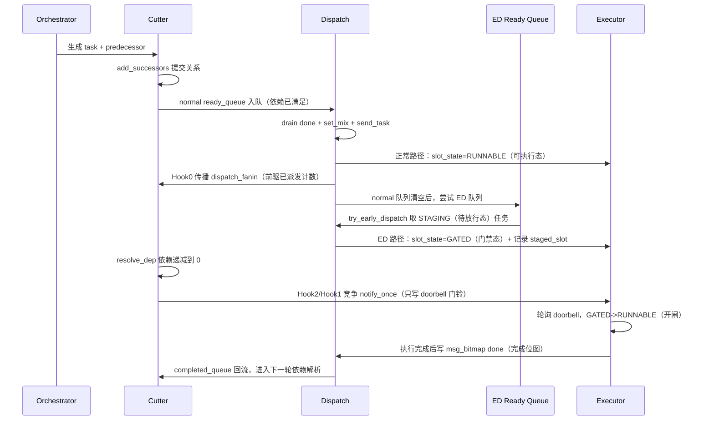

# ESL Proxy 当前实现进展（汇报版）

## 1) 当前代码整体运行逻辑（端到端）

### 1.1 核心角色

- **Orchestrator（编排器：负责生成任务和依赖）**：在 `main` 线程里调用业务编排入口，持续创建任务并写入环形缓冲区（Ring Buffer，循环复用的固定容量任务槽）。
- **Cutter（解依赖器：负责把“依赖满足”的任务放入就绪队列）**：提交新任务、挂接前驱后继关系、消费完成事件并递减依赖计数。这里的就绪队列（`ready_queue`）就是“等待派发”的任务列表。
- **Dispatch（派发器：负责把就绪任务放到执行槽）**：从就绪队列取任务，选择核与槽位，发布给执行器。
- **Executor（执行器：负责模拟执行并回传完成）**：轮询可执行槽，推进执行进度，完成后回写 done 位图（`bitmap`，用二进制位表示“哪个核已完成”）。

### 1.2 正常路径 + ED 路径协作图

> 说明：**ED（Early Dispatch，提前派发）** 指“任务依赖尚未完全归零前，先占一个执行槽并等待放行”。

### 1.3 一句话理解协作关系

- **正常路径保证吞吐**：依赖已满足任务优先直发 `RUNNABLE`。
- **ED 路径争取时延**：在“正常队列暂时不忙”时投机（先试）预占，等 Hook2 放行后可更快开跑。
- 两条路径通过 `g_next_block_idx` 的 **CAS（Compare-And-Swap，比较并交换的原子操作）** 抢占协议互斥，避免同一任务被重复派发。

---

## 2) 关键代码改动（聚焦三个 Hook）

> Hook（钩子点）：在固定代码位置插入额外逻辑，不改主流程框架。

### Hook 0：`dispatch` 成功发布后传播 fanin（已派发前驱计数）

- 位置：`dispatch.c` 的 `send_task` 成功发布后调用 `propagate_dispatch_fanin(task_id)`。
- 作用：后继任务看到“前驱已进入可运行链路”的计数增长，满足目标时可进入 `STAGING`。
- 关键补强：`cutter.c` 的 `add_successors` 增加 **late-arrival（迟到挂边）补偿**，避免“前驱先派发、后继后挂边”时丢计数。

### Hook 1：`try_early_dispatch` 预占槽位（进入 GATED）

- 位置：`early_dispatch.c` 的 `try_early_dispatch`。
- 作用：从 `ed_ready_queue` 取任务，先占空闲槽位，发布为 `EXE_SLOT_GATED`（门禁态：已装载但不可执行）。
- 关键改动：
  - 用 `g_next_block_idx` 的 CAS 抢占整任务，和正常路径共用同一互斥协议；
  - 写入 `g_staged_slot_record`（含代际 `tag`，即“这是第几代任务”的标记）用于后续安全放行；
  - 只有当状态已是 `DISPATCHED` 时才触发 Hook1 自通知。

### Hook 2：依赖 1->0 时统一放行（notify_once）

- 位置：`cutter.c` 的 `resolve_dep`。
- 作用：当 `unfin_pred_cnt`（未完成前驱计数）从 1 到 0，把状态切到 `DISPATCHED`，并尝试调用 `ed_notify_once`。
- 关键改动：
  - 通知语义调整为“**只敲 doorbell（门铃）**”，不直接改 `slot_state`；
  - 真正 `GATED->RUNNABLE` 在 `executor` 侧 `ed_poll_doorbell` 完成，职责边界更清晰；
  - `notify_claimed` CAS 保证 Hook1/Hook2 竞争时最多一次有效通知。

---

## 3) 当前性能测试结果（4 个输入 Case）

### 3.1 测试方法

- 输入 case：`qwen3_dynamic_manual_scope.h`、`qwen3_dynamic_tensormap.h`、`paged_attention_unroll.h`、`paged_attention_unroll_manual_scope.h`。
- 每个配置连续跑 9 次，取中位数（中位数：排序后取中间值，减少偶发抖动的影响）。
- 三组构建做成本拆解，除标注项外其余参数完全一致：
  - **A** = `ED_ENABLE=0`：没有 ED 代码，基线。
  - **B** = `ED_ENABLE=1` + `ED_UNFIN_THRESHOLD=0`：ED 代码全在，但几乎不预占槽位。
  - **C** = `ED_ENABLE=1` 正常工作。
  - 于是 **B 减 A = ED 的常驻开销**，**C 减 B = 提前占槽本身的影响**。
- 任务长短用 `EXEC_DURATION_SCALE` 控制（数值越小，单任务模拟执行越长）。主对比取 `=100`。
- 核心指标：
  - `makespan`：端到端执行时间（调度开始到全部任务完成）。
  - `ready->runnable` 延迟：任务“依赖刚满足”到“真正可执行”的空等时间，分 normal / ed 两条路径统计。
  - `覆盖率` = `stage_cnt / task_cnt`：ED 实际接管了多少比例的任务。
- 原始数据：`tmp/perf_runs.csv`（4 档任务长短全矩阵）、`tmp/ed_cost_split.csv`（A/B/C 成本拆解）。

> 正确性回归（`test-step4`~`test-step7`）已全部通过，本节只讲性能。

### 3.2 核心结论：ED 路径确实变快了，代价是 normal 路径变慢

`EXEC_DURATION_SCALE=100`，`ready->runnable` 延迟中位数（单位 ns）：

| 输入 case | A：ED关 normal | C：ED开 normal | C：ED开 ed 路径 | ed 路径 / 基线 | normal 路径 / 基线 | 覆盖率 |
| --- | --- | --- | --- | --- | --- | --- |
| `qwen3_dynamic_manual_scope.h` | 1,520 | 1,847 | 1,626 | 1.07x | 1.22x | 8.2% |
| `qwen3_dynamic_tensormap.h` | 1,112 | 1,390 | 1,510 | 1.36x | 1.25x | 8.3% |
| `paged_attention_unroll.h` | 617,515 | 520,973 | 198,335 | **0.32x** | 0.84x | 3.1% |
| `paged_attention_unroll_manual_scope.h` | 647,553 | 525,683 | 179,991 | **0.28x** | 0.81x | 3.1% |

要点：

- **`paged` 两个 case：ED 路径延迟只有基线的 0.28~0.32x（快约 3 倍）**，这是 ED 机制生效的直接证据，且在两批独立实验里都复现（另一批为 0.32x / 0.35x）。
- **`qwen3` 两个 case：ED 路径没有稳定收益**（1.07x / 1.36x，另一批为 0.77x / 0.97x），跨批次方向不一致。
- normal 路径普遍慢于基线（1.22x / 1.25x），这是 ED 目前最主要的副作用。

⚠️ **一个容易得出错误结论的对比口径**：如果拿“同一次运行里 ed 路径 vs normal 路径”比，ED 看起来赢得更多（`paged` 为 0.34~0.37x，`qwen3_manual` 甚至 9/9 次都赢、比值 0.65x）。但这个分母（ED 开启后的 normal 路径）本身已经被拖慢了，所以会**高估** ED 收益。判断真实收益必须和 **A：ED 关闭时的 normal 路径**比。

### 3.3 局部收益撑不起全局：覆盖率太低

把“ED 为它覆盖的任务省下的延迟”和“normal 路径多付出的延迟”做总账（覆盖任务数 × 单任务收益 vs normal 任务数 × 单任务损失）：

- ED 覆盖率只有 **3%（paged）~ 8%（qwen3）**，而受影响的 normal 任务占其余 90% 以上。
- 全矩阵 16 个配置（4 case × 4 档任务长短）的净额**全部为负**。例如 `paged_attention_unroll` 长任务档：ED 省下约 209 ms，normal 多付出约 1,501 ms，净亏约 1,292 ms。
- 结论：ED 单点提速是真的，但覆盖面太小、副作用面太大，目前无法转化为端到端收益。

### 3.4 成本拆解：主要问题不是“抢槽”，而是 ED 的常驻开销

makespan 比值（A/B/C 定义见 3.1，两批独立实验）：

| 输入 case | B/A（常驻开销） | C/B（抢槽影响） |
| --- | --- | --- |
| `qwen3_dynamic_manual_scope.h` | 1.21x / 1.34x | 0.94x / 0.73x |
| `qwen3_dynamic_tensormap.h` | 1.19x / 1.50x | 0.87x / 1.08x |
| `paged_attention_unroll.h` | 1.35x / 0.99x | 0.98x / 0.85x |
| `paged_attention_unroll_manual_scope.h` | 1.41x / 0.85x | 1.00x / 0.94x |

要点：

- `qwen3` 两个 case 在两批里都是 **B/A ≥ 1.19**：只要 ED 代码编进热路径，即使几乎不预占槽位，makespan 也变差约 20%~50%。
- 相对地，**C/B 多数 ≤ 1.0**：真正“提前占槽”这一步反而是中性甚至略有改善的。
- 因此优化重点应放在**削减 ED 的常驻开销**，而不是先去调投机策略。

### 3.5 测量可信度：makespan 目前还不足以下定论（需先解决）

- 同一配置连跑 9 次，makespan 变异系数（CV，波动幅度占均值的比例）中位数 **13.5%**，最差 **130%**；最差配置的 max/min 达到 **8.73x**。
- 跨批次结论会翻转：`paged_attention_unroll` 的 B/A 在一批是 1.35x（变差），另一批是 0.99x（无差别）。
- 主要噪声来源：所有 worker 线程都是忙等自旋，被操作系统抢占会直接计入 makespan；且 makespan 口径把编排、解依赖、派发、模拟执行混在一起（`dispatch.c` 注释已说明）。
- 因此本报告**不给出“ED 让端到端快/慢百分之多少”的结论**；相对可信的是同批次内的比值型指标（3.2、3.4）。

### 3.6 随任务长短的变化趋势

- ED 路径的**绝对**延迟基本跟着任务长度同比例放大。以 `paged_attention_unroll` 的 ed 路径 p50 为例：长任务 1,578,917 ns → 中任务 262,144 ns → 短任务 512 ns。
- 但**比值**稳定：ED 路径相对基线始终在 0.25x~0.35x 区间，说明收益比例与任务长短基本无关。
- 机制解释：ED 预占的槽位要等到该核当前正在跑的任务结束才可能开闸（每核同时只跑一个槽位），所以任务越长，被压住的绝对时间越长。
- 覆盖率不稳定：`paged` 在极短任务档会从 3% 跳到 30%，说明 ED 触发条件强烈依赖运行时时序（正常队列是否恰好排空），不是一个可控量。

---

## 4) 基于测试结果的优化方向

### 4.1 P0：先把测量台做可信（否则后续所有优化都无法判定）

- 补充**免疫跨运行漂移**的指标做主判据：同批次比值、`dispatch_rounds`、槽位空闲率、`starve%`（`LAT_TRACE` 已有输出），而不是只看墙上时钟。
- 基准脚本固化：固定重复次数、输出中位数与 min-max 区间，禁止用单次结果下结论。
- 降低噪声：跑基准时隔离其他负载；有条件时迁到 Linux 上绑核跑，避免忙等线程被随机抢占。
- 目标：把 makespan 的 CV 从 13.5% 压到 5% 以内，使 5% 级别的效应可被检出。

### 4.2 P1：削减 ED 常驻开销（3.4 指出的主因）

按预期收益排序的候选点，都需在 4.1 的新基准下逐项验证：

- `dispatch()` 每轮都调用 `has_pending_normal_work()`，里面为 3 个队列各加解一次锁——即使队列是空的。改为无锁读原子计数。
- `try_early_dispatch()` 在 ED 队列为空时仍会加一次队列锁才发现没活干。先用无锁计数判空再决定是否进队列。
- `executor` 空闲扫描时，对**所有非 RUNNABLE 槽位**（含最常见的 EMPTY）都调用 `ed_poll_doorbell` 读门铃。改成只在 `GATED` 时轮询即可；stager 在发布 GATED 前已清过门铃，EMPTY 槽位不需要吸收残留。
- `propagate_dispatch_fanin()` 无条件先拿边锁再看后继数量。可在无后继时于进锁前快速返回（需确认不破坏与 `add_successors` 的线性化约定）。
- `ed_init_task_meta()` 每提交一个任务就要拿边锁 + 约 10 次原子写。考虑合并写入或按需初始化。

### 4.3 P2：提高 ED 的价值密度（3.2、3.3 指出的方向）

- **优先复制 `paged` 的成功条件**：先查清为什么 `paged` 的 ED 路径能稳定拿到 0.3x，而 `qwen3` 拿不到（怀疑与 CUBE/VECTOR 交替导致 `pick_stage_core` 一选恒空、以及 `qwen3` 本身空等时间已很短有关）。
- **让触发条件可控**：当前覆盖率会在 3%~30% 之间跳变，说明“正常队列恰好排空”这个触发条件太依赖时序。改为显式预算控制（每轮允许的 stage 名额），使覆盖率可配置、可复现。
- **只投机有价值的任务**：优先选择预计很快依赖归零、且卡在关键路径上的任务；对“预占后要等本核长任务跑完才能开闸”的情况直接放弃预占（3.6 的机制问题）。

### 4.4 验收标准（建议写进下一里程碑）

- 前置：makespan CV ≤ 5%（4.1 完成）。
- ED 常驻开销：B/A ≤ 1.05x（即 ED 代码在场但不预占时，几乎不拖慢基线）。
- ED 路径收益：4 个 case 中至少 3 个的 ed 路径延迟 ≤ 基线 normal 的 0.5x。
- normal 路径副作用：C/A ≤ 1.05x。
- 端到端：至少 3 个 case 的 makespan 相对基线改善 ≥ 5%，且跨两批实验方向一致。
