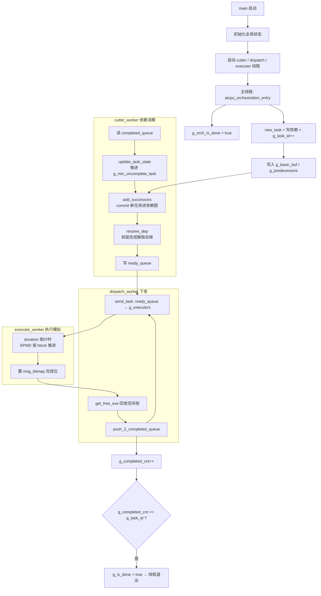

# algorithm 代码基础结构

> 本文档梳理 `esl_proxy/esl_proxy` 下 **algorithm 侧**（动态编排 + 调度仿真）的整体结构、执行流程、关键函数与关键变量，作为进一步编程的基础参考。
>
> 分支：`early-dispatch`  
> 同级文档：[early-dispatch机制设计.md](./early-dispatch机制设计.md)

---

## 1. 这套代码在做什么

algorithm 侧是一个 **AICPU 编排代理（Orchestrator Proxy）**：

1. **编排线程**（主线程）按模型逻辑动态创建任务（task），写入任务描述和依赖关系；
2. **Cutter 线程**维护 DAG（有向无环图：任务先后依赖关系网），决定哪些任务可以执行；
3. **Dispatch 线程**把可执行任务下发到模拟 NPU 核；
4. **Executor 线程**（可选）用 `duration` 倒计时模拟核上执行，完成后回报 Dispatch。

最终产物：`bin/esl_proxy`，通过 `make CASE=xxx.h run` 运行。

---

## 2. 目录结构（algorithm 相关）

```
esl_proxy/esl_proxy/
├── src/
│   ├── main.c                    # 主入口：初始化 + 起线程 + 跑编排
│   └── algorithm/
│       ├── shm.c                 # 全局变量定义（g_task_id、g_basic_buf 等）
│       ├── cutter.c              # 依赖消解线程
│       ├── dispatch.c            # 下发线程 + init_ctrl_t
│       ├── executor.c            # 核执行模拟线程
│       ├── early_dispatch.c      # early-dispatch 扩展（本分支）
│       ├── manager.c             # 内存回收线程（当前未启用）
│       └── log.c                 # 日志
├── include/algorithm/
│   ├── conf.h                    # 全局常量（RING_SIZE、AIC_CNT 等）
│   ├── task.h                    # task_desc、task_state、task_type
│   ├── ring_buf.h                # 任务环形缓冲 API（new_task、add_predecessors）
│   ├── queue.h                   # 批量队列（ready/completed）
│   ├── dispatch.h                # ctrl_t 调度控制块
│   ├── executor.h                # executor_t 核执行状态
│   ├── tensor.h                  # Tensor 128B 布局
│   ├── tensormap.h               # 自动依赖推导（编排胶水层）
│   ├── tensormap_core.h          # TensorMap 核心实现
│   ├── mem_pool.h                # 张量内存池
│   └── early_dispatch.h          # early-dispatch 类型与 API（本分支）
├── cases/                        # 编排 case 头文件（编译期 #include 进 main）
│   ├── qwen3_dynamic_manual_scope.h
│   ├── qwen3_dynamic_tensormap.h
│   └── ...
└── Makefile                      # 构建 bin/esl_proxy
```

**注意**：仓库里还有一套独立的 **scheduler 侧**（`src/scheduler/` + 根目录 `Makefile_scheduler`），用静态图测纯调度性能，与 algorithm 侧并行存在，本文档不展开。

---

## 3. 总体执行流程



### 3.1 生命周期时序（8 个关键点）

| 序号 | 事件 | 关键函数/变量 |
|------|------|---------------|
| 1 | main 初始化 | `mem_pool_init`、`ring_buf_init`、`init_predecessors`、`init_ctrl_t` |
| 2 | 启动后台线程 | `cutter_worker`、`dispatch_worker`、`executor_worker` |
| 3 | 主线程跑编排 | `aicpu_orchestration_entry()`（来自 `cases/*.h`） |
| 4 | 创建任务 | `new_task()` → 写 `g_basic_buf[task_id]` |
| 5 | 写依赖 | `add_predecessors()` 或 `tm_submit()` |
| 6 | Cutter commit | `add_successors()`：`g_commit_task_id` → `g_task_id` |
| 7 | Dispatch 下发 | `send_task()` → 写 `g_executors[type][core]` |
| 8 | 完成收尾 | `g_completed_cnt >= g_task_id` → `g_is_done = true` |

---

## 4. 线程模型

| 线程 | 入口函数 | 源文件 | 职责 |
|------|----------|--------|------|
| 主线程 | `main()` → `aicpu_orchestration_entry()` | `src/main.c` + `cases/*.h` | 动态创建任务、写依赖、分配张量 |
| Cutter | `cutter_worker()` | `src/algorithm/cutter.c` | 依赖消解：commit 新任务、解锁 ready |
| Dispatch | `dispatch_worker()` | `src/algorithm/dispatch.c` | 核资源分配、任务下发、完成回报 |
| Executor | `executor_worker()` | `src/algorithm/executor.c` | 模拟核上执行（duration 倒计时） |
| Manager | `manager_worker()` | `src/algorithm/manager.c` | 内存回收（**当前未启用**） |

线程数由 `include/algorithm/conf.h` 控制：

```c
#define CUTTER_THREAD_CNT   1
#define DISPATCH_THREAD_CNT 1
#define EXECUTOR_THREAD_CNT 1   // early-dispatch 分支已定义
#define AIC_CNT             60  // 模拟核数
#define AIC_OSTD            2   // 每核 outstanding 槽位数（双缓冲）
```

---

## 5. 关键数据结构

### 5.1 任务描述：`struct task_desc`（`include/algorithm/task.h`）

任务的**静态信息**，不含执行状态：

```c
struct task_desc {
    uint32_t    id;
    task_type_t type;        // CUBE(0) / VECTOR(1) / MIX(1)
    org_mode_t  mode;        // SINGLE / SPMD_SYNC 等
    void       *kernel;
    uint32_t    index;       // SPMD base block index
    uint32_t    count;       // SPMD block 数（subtask 数）
    uint64_t    data[16];    // 张量 buffer_addr
    int64_t     scalar[32];  // 标量参数
    uint32_t    duration;    // 模拟执行周期
    ...
};
```

存储在 `g_basic_buf[RING_SIZE]`，通过 `task_id & RING_MASK` 索引。

### 5.2 任务状态：`task_state`（cutter 维护）

```c
typedef struct {
    task_status_t state;       // CREATING / COMPLETED
    uint32_t      task_id;
    uint32_t      successor_cnt;
} task_state;
```

存储在 `g_state_buf[RING_SIZE]`（cutter 内 `malloc`）。

### 5.3 调度控制块：`ctrl_t`（`include/algorithm/dispatch.h`）

每个 Dispatch 线程一份：

```c
typedef struct ctrl {
    uint64_t free_bitmap[TASK_TYPE_CNT][AIC_OSTD];  // 哪些核/槽位空闲
    uint64_t msg_bitmap[EXE_TYPE_CNT][AIC_OSTD];   // 哪些核/槽位刚完成
    uint32_t task_id_map1[EXE_TYPE_CNT][AIC_CNT];  // 核→task_id 映射（slot0）
    uint32_t task_id_map2[EXE_TYPE_CNT][AIC_CNT];  // 核→task_id 映射（slot1）
    queue_t  ready_queue[TASK_TYPE_CNT];            // 可执行任务队列
    queue_t  completed_queue;                       // 已完成任务队列
} ctrl_t;
```

### 5.4 核执行状态：`executor_t`（`include/algorithm/executor.h`）

```c
typedef struct executor {
    uint8_t  idx;                    // 当前 active slot；=AIC_OSTD 表示空闲
    uint32_t tasks[AIC_OSTD];        // 各 slot 上的 task_id
    uint32_t block_idx[AIC_OSTD];    // SPMD 当前 block 进度
    uint32_t duration[AIC_OSTD];     // 剩余模拟周期
    uint64_t base[AIC_OSTD];         // 预留
} executor_t;
```

全局：`g_executors[EXE_TYPE_CNT][AIC_CNT]`，定义在 `src/algorithm/shm.c`。

### 5.5 依赖边

| 结构 | 方向 | 写入者 | 读取者 |
|------|------|--------|--------|
| `g_predecessors[i]` | 任务 i 的前驱列表 | 编排 `add_predecessors` | Cutter `add_successors` |
| `g_successor_buf[i].node[]` | 任务 i 的后继列表 | Cutter `add_successors` | Cutter `resolve_dep` |
| `g_predecessor_cnt[i]` | 任务 i 剩余未完成前驱数 | Cutter | Cutter `resolve_dep` |

---

## 6. 关键全局变量（`src/algorithm/shm.c`）

| 变量 | 类型 | 作用 | 主要写入者 | 主要读取者 |
|------|------|------|-----------|-----------|
| `g_task_id` | `atomic_int` | 已创建任务上界 | 编排 `g_task_id++` | cutter/dispatch |
| `g_subtask_cnt` | `int` | SPMD 子任务总数 | `new_task` | main 日志 |
| `g_orch_is_done` | `atomic_bool` | 编排是否结束 | main | dispatch |
| `g_is_done` | `atomic_bool` | 全局退出信号 | dispatch | cutter/executor |
| `g_min_uncomplete_task` | `atomic_int` | 最早未完成任务水位线 | cutter | `new_task` 回压、tensormap |
| `g_completed_cnt` | `atomic_int` | 已完成任务计数 | dispatch | dispatch 退出条件 |
| `g_basic_buf[RING_SIZE]` | `task_desc[]` | 任务描述主存 | 编排 | dispatch/executor/cutter |
| `g_predecessors[RING_SIZE]` | `predecessor_list[]` | 前驱边 | 编排 | cutter |
| `g_successor_buf[RING_SIZE]` | `node_list[]` | 后继边 | cutter | cutter |
| `g_ctrl_t[DISPATCH_THREAD_CNT]` | `ctrl_t[]` | 调度控制块 | cutter/dispatch | cutter/dispatch |
| `g_executors[EXE_TYPE_CNT][AIC_CNT]` | `executor_t[][]` | 核执行状态 | dispatch | executor |
| `g_mem_pool` | `mem_pool_t` | 张量内存池 | case 分配 | case |

**Cutter 私有变量**（`cutter.c` 内）：

| 变量 | 作用 |
|------|------|
| `g_commit_task_id` | Cutter 已 commit 到哪个 task（编排创建 vs Cutter 处理的进度差） |
| `g_completed_task_cnt` | Cutter 侧完成计数（调试用） |
| `g_predecessor_cnt[RING_SIZE]` | 每个 task 剩余未完成前驱数 |

---

## 7. 关键函数地图

### 7.1 主入口（`src/main.c`）

```
main()
├── mem_pool_init / ring_buf_init / init_predecessors / init_ctrl_t
├── executor_init()                          // early-dispatch 分支已启用
├── pthread_create(cutter_worker)
├── pthread_create(dispatch_worker)
├── pthread_create(executor_worker)          // early-dispatch 分支已启用
├── aicpu_orchestration_entry(0)             // cases/*.h 提供
├── g_orch_is_done = true
└── pthread_join(cutter / dispatch / executor)
```

### 7.2 编排 API（`include/algorithm/ring_buf.h` + `cases/*.h`）

| 函数/宏 | 作用 |
|---------|------|
| `new_task(task_id, type, count, duration)` | 创建任务描述；`count>1` 时为 SPMD；受 `g_min_uncomplete_task` 回压 |
| `add_input/add_output/add_scalar` | 写 task 参数 |
| `add_predecessors(task_id, targets, n, start)` | 手工登记前驱依赖 |
| `set_task_type(task_id, type)` | 设置 CUBE/VECTOR 类型 |

**回压机制**（环形缓冲区限流）：

```c
while ((task_id - g_min_uncomplete_task) >= RING_SIZE) spin_wait();
```

### 7.3 自动依赖（`include/algorithm/tensormap.h`）

tensormap case 的标准五步：

```c
new_task(g_task_id, TASK_TYPE_CUBE, cur_blocks, DUR_Q_PROJ);
tm_in(g_task_id, input_tensor);      // 登记输入 → 查重叠 producer
tm_out(g_task_id, output_tensor);    // 登记输出 → 后续 insert
add_scalar(g_task_id, ...);
tm_submit(g_task_id);                // 查前驱 + add_predecessors + insert
g_task_id++;
```

`tm_submit` 内部流程：
1. `tm_sync_tensormap` — 按 `g_min_uncomplete_task` 清理过期 entry
2. `tm_lookup_tensor` — 查 input 重叠的 producer → 收集前驱
3. `add_predecessors` — 写入前驱边
4. `tm_insert_tensor` — 登记 output producer

### 7.4 Cutter（`src/algorithm/cutter.c`）

```
cutter_worker()
└── 循环 deal_completed_queue()
    ├── batch_dequeue(completed_queue)     // 读 Dispatch 报的完成
    ├── update_task_state()              // 标 COMPLETED，推进 g_min_uncomplete_task
    ├── add_successors()                 // commit [g_commit_task_id, min(+240, g_task_id)]
    │   ├── 无前驱 → 直接 ready
    │   ├── 有前驱且未完成 → 建反向边，predecessor_cnt++
    │   └── predecessor_cnt==0 → ready
    ├── resolve_dep()                    // 前驱完成 → 后继 predecessor_cnt--，到 0 则 ready
    └── send_2_ready_queue()             // batch_enqueue → ctrl_t.ready_queue
```

**commit 含义**：Cutter 把编排已创建、但调度侧尚未处理的任务，按 `g_commit_task_id` 进度逐批纳入依赖图。不是 Git commit，而是「编排 → Cutter 调度系统」的提交。

### 7.5 Dispatch（`src/algorithm/dispatch.c`）

```
dispatch_worker()
├── 阶段1: while (!g_orch_is_done)  dispatch()
└── 阶段2: while (g_completed_cnt < g_task_id)  dispatch()
    └── g_is_done = true

dispatch(tid)
├── get_free_exe()              // msg_bitmap 合并进 free_bitmap，回收空闲核
├── push_2_completed_queue()    // 扫 msg_bitmap → completed_queue → g_completed_cnt++
└── send_task(MIX/VECTOR/CUBE)  // ready_queue → g_executors，清 free 位
```

**send_task 核心逻辑**：
1. `free_bitmap = free[0] & free[1]` — 两个 slot 都空的核
2. `batch_dequeue(ready_queue)` — 取同样数量的 task
3. 写 `g_executors[type][core].tasks[slot]`、`duration[slot]`
4. 清 `free_bitmap`，置完成（main 分支 Fake Return；early-dispatch 由 Executor 真实报）

### 7.6 Executor（`src/algorithm/executor.c`）

```
executor_worker()
└── while (!g_is_done)
    └── 扫描 g_executors[exe_type][core]
        ├── idx < AIC_OSTD → 正在跑：duration--，SPMD 按 block 推进
        │   └── duration==0 且 block 跑完 → msg_bitmap[exe_type][idx] |= (1<<core)
        └── idx == AIC_OSTD → 空闲：扫描 slot 找 duration>0 的任务
```

---

## 8. 编排两条路径对比

| | manual scope | tensormap |
|---|---|---|
| case 文件 | `qwen3_dynamic_manual_scope.h` | `qwen3_dynamic_tensormap.h` |
| 依赖方式 | 手写 `add_predecessors()` | `tm_in/out` + `tm_submit()` 自动推导 |
| 典型调用 | `batch_predecessors[0]=rmsnorm_id; add_predecessors(...)` | `tm_in(...); tm_out(...); tm_submit(...)` |
| 底层殊途同归 | 都写入 `g_predecessors` + `g_predecessor_ring` | 同上 |

---

## 9. 调度闭环（Cutter ↔ Dispatch）

```
编排创建任务
    │ g_task_id++
    ▼
Cutter add_successors (commit)
    │ 依赖满足 → ready_queue
    ▼
Dispatch send_task
    │ g_executors[type][core]
    ▼
Executor duration 倒计时（或 Fake Return）
    │ msg_bitmap
    ▼
Dispatch push_2_completed_queue
    │ completed_queue
    ▼
Cutter resolve_dep
    │ 解锁后继 → ready_queue
    └── 循环
```

---

## 10. early-dispatch 分支差异（相对 main）

本分支在 baseline 调度流水线之上叠加 early-dispatch 能力：

| 项目 | main 分支 | early-dispatch 分支 |
|------|-----------|---------------------|
| Executor 线程 | 注释掉 | **已启用** `executor_init` + `executor_worker` |
| Fake Return | dispatch 下发后立即标完成 | **去掉**，由 Executor 真实报 `msg_bitmap` |
| `init_ctrl_t` | 仅在 scheduler 侧实现 | **algorithm 侧** `dispatch.c` 已实现 |
| `EXECUTOR_THREAD_CNT` | 未定义 | conf.h 已定义 |
| `node_list` | 仅在 scheduler/painter.h | **task.h** 也有定义 |
| 新增模块 | — | `early_dispatch.c/h`（Hook 0/1/2 基础设施） |
| 新增测试 | — | `test_ed_record.c` 等 |

early-dispatch 详细设计见同级文档：
- [early-dispatch机制设计.md](./early-dispatch机制设计.md)
- [early-dispatch设计方案.md](./early-dispatch设计方案.md)
- [early-dispatch一期开发方案.md](./early-dispatch一期开发方案.md)

---

## 11. 构建与运行

```bash
cd esl_proxy/esl_proxy

# 默认 case
make run

# 指定 case
make CASE=qwen3_dynamic_manual_scope.h run
make CASE=qwen3_dynamic_tensormap.h run

# Qwen3 SPMD 档位（0=non-spmd .. 4=all-spmd，默认 2）
make CASE=qwen3_dynamic_tensormap.h QWEN3_SPMD_TIER=4 run

# 开 worker 日志
make CASE=qwen3_dynamic_tensormap.h WORKER_LOG=1 run
```

产物：`bin/esl_proxy`

---

## 12. 二次开发入口索引

| 想改什么 | 看哪里 |
|----------|--------|
| 任务生成 / 模型结构 | `cases/*.h`（`new_task`、`tm_submit` 调用点） |
| 手工依赖 | `add_predecessors()` in `ring_buf.h` |
| 自动依赖（张量重叠） | `tensormap.h` / `tensormap_core.h` |
| 依赖消解策略 | `src/algorithm/cutter.c` |
| 核分配 / 下发策略 | `src/algorithm/dispatch.c` |
| 执行时间模型 | `src/algorithm/executor.c` |
| early-dispatch | `src/algorithm/early_dispatch.c` |
| 全局常量 / 线程数 | `include/algorithm/conf.h` |
| 张量内存分配 | `include/algorithm/mem_pool.h` |
| 日志 | `src/algorithm/log.c` |

---

## 13. 当前已知限制

1. **`TASK_TYPE_MIX` 与 `TASK_TYPE_VECTOR` 值相同（均为 1）**，dispatch 对 MIX/VECTOR 连续调两次 `send_task` 实际操作同一队列。
2. **Manager 内存回收线程未启用**，`manager.c` 中 `return NULL` 在循环之前。
3. **`mem_pool.h` 引用 `ring_min_uncompleted()` 但未实现**（mem_pool 回收路径不完整）。
4. **Executor 的 `duration` 是抽象 tick**，非 wall-clock 纳秒仿真；Dispatch 已做 `/10000` 缩放。
5. **Work Stealing（工作窃取：空闲线程从别的线程偷任务）** 在 dispatch 中标记 TODO，当前未实现。

---

## 14. 相关 spec 文档

`esl_proxy/specs/` 下各模块设计文档，建议按 cutter → dispatch → executor 顺序阅读：

| 编号 | 模块 | 路径 |
|------|------|------|
| 001 | orchestrator | `specs/001-orchestrator/spec.md` |
| 003 | executor | `specs/003-executor/spec.md` |
| 004 | dispatch | `specs/004-dispatch/spec.md` |
| 006 | cutter | `specs/006-cutter/spec.md` |
| 007 | memory-pool | `specs/007-memory-pool/spec.md` |
| 009 | ring-buffer | `specs/009-ring-buffer/spec.md` |
| 010 | mpmc-queue | `specs/010-mpmc-queue/spec.md` |
