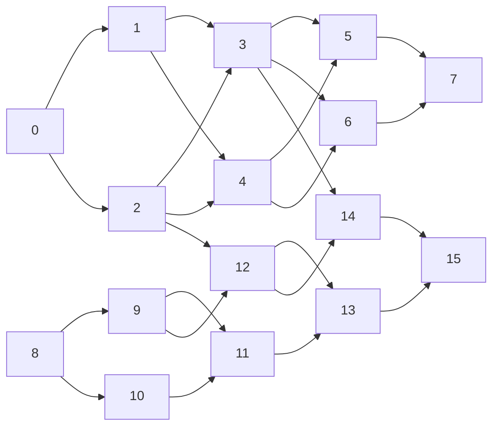

**Edge check**: 24 predecessor-edges vs 24 successor-edges -> **MATCH**

Edge sets are identical, so the two rendered graphs would necessarily be identical too.

## predecessors view (rebuilt from the original file)

## successors view (rebuilt from the generated file)

